# 變換(Transformations)

// TODO 校對過程中有對原來的翻譯大段大段重寫，變動比較大(特別前半部分)，可能還需要重新校對一遍

原文     | [Transformations](http://learnopengl.com/#!Getting-started/Transformations)
      ---|---
作者     | JoeyDeVries
翻譯     | Django
校對     | Meow J

儘管我們現在已經知道了如何創建一個物體、著色、加入紋理從而給它們一些細節的表現，但是它們仍然還是不夠有趣，因為它們都還是靜態的物體。我們可以嘗試著在每一幀改變物體的頂點並且重設緩衝區從而使他們移動，但這太繁瑣了，而且會消耗很多的處理時間。然而，我們現在有一個更好的解決方案，使用(多個)矩陣(Matrix)對象可以更好的變換(Transform)一個物體。當然，這並不是說我們會去討論武術和數字虛擬世界(譯註：Matrix同樣也是電影「黑客帝國」的英文名，電影中人類生活在數字虛擬世界，主角會武術)。

**矩陣**(Matrix)是一種非常有用的數學工具，儘管聽起來可能有些嚇人，不過一旦你理解了它們後，它們會非常有用。在討論矩陣的過程中，我們需要使用到一些數學知識。對於一些願意多瞭解這些知識的讀者，我會附加一些資源給你們閱讀。

為了深入瞭解變換，我們首先要在討論矩陣之前瞭解一點向量(Vector)。這一節的目標是讓你擁有將來需要的最基礎的數學背景知識. 如果你發現這節十分困難，儘量嘗試去理解它們，當你以後需要它們的時候回過頭來複習這些概念。

## 向量(Vector)

向量最最基本的定義就是一個方向。或者更正式的說，向量有一個**方向(Direction)**和**大小(Magnitude，也叫做強度或長度)**。你可以把向量想成一個藏寶圖上的指示：“向左走10步，向北走3步，然後向右走5步”；“左”就是方向，“10步”就是向量的長度。你可以發現，這個藏寶圖的指示一共有3個向量。向量可以在任意**維度**(Dimension)上，但是我們通常只使用2至4維。如果一個向量有2個維度，它表示一個平面的方向(想象一下2D的圖像)，當它有3個維度的時候它可以表達一個3D世界的方向。

下面你會看到3個向量，每個向量在圖像中都用一個箭頭(x, y)表示。我們在2D圖片中展示這些向量，因為這樣子會更直觀. 你仍然可以把這些2D向量當做z座標為0的3D向量。由於向量表示的是方向，起始於何處**並不會**改變它的值。下圖我們可以看到向量和是相等的，儘管他們的起始點不同：


數學家喜歡在字母上面加一橫表示向量，比如說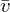。當用在公式中時它們通常是這樣的：

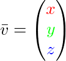

由於向量是一個方向，所以有些時候會很難形象地將它們用位置(Position)表示出來。我們通常設定這個方向的原點為(0,0,0)，然後指向對應座標的點，使其變為**位置向量(Position Vector)**來表示(你也可以把起點設置為其他的點，然後說：這個向量從這個點起始指向另一個點)。位置向量(3, 5)的在圖像中起點是(0, 0)，指向(3, 5)。我們可以使用向量在2D或3D空間中表示方向**與**位置.

和普通數字一樣，我們也可以用向量進行多種運算(其中一些你可能已經知道了)。

### 向量與標量運算(Scalar Vector Operations)

**標量(Scalar)**只是一個數字(或者說是僅有一個分量的矢量)。當把一個向量加/減/乘/除一個標量，我們可以簡單的把向量的每個分量分別進行該運算。對於加法來說會像這樣:

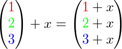

其中的+可以是+，-，·或÷，其中·是乘號。注意－和÷運算時不能顛倒，因為顛倒的運算是沒有定義的(標量-/÷矢量)

### 向量取反(Vector Negation)

對一個向量取反會將其方向逆轉。一個指向東北的向量取反後就指向西南方向了。我們在一個向量的每個分量前加負號就可以實現取反了(或者說用-1數乘該向量):

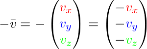

### 向量加減

向量的加法可以被定義為是**分量的(Component-wise)**相加，即將一個向量中的每一個分量加上另一個向量的對應分量：

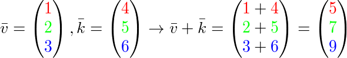

向量v = (4, 2)和k = (1, 2)直觀地表示為：


就像普通數字的加減一樣，向量的減法等於加上第二個向量的相反數：

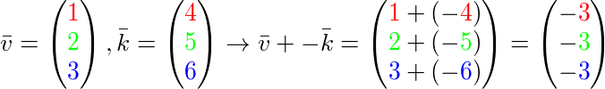

兩個向量的相減會得到這兩個向量指向位置的差. 這在我們想要獲取兩點的差會非常有用.


### 長度(Length)

我們使用**勾股定理(Pythagoras Theorem)**來獲取向量的長度/大小. 如果你把向量的x與y分量畫出來，該向量會形成一個以x與y分量為邊的三角形:


因為兩條邊(x和y)是已知的，而且我們希望知道斜邊的長度，所以我們可以通過勾股定理來計算出它:

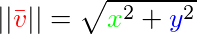

表示向量的大小，我們也可以很容易加上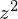把這個公式拓展到三維空間

例子中向量(4, 2)的長度等於：

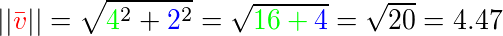

結果是4.47。

有一個特殊類型向量叫做**單位向量(Unit Vector)**。單位向量有一個特別的性質——它的長度是1。我們可以用任意向量的每個分量除以向量的長度得到它的單位向量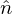：

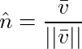

我們把這種方法叫做一個向量的**標準化(Normalizing)**。單位向量頭上有一個^樣子的記號，並且它會變得很有用，特別是在我們只關心方向不關係長度的時候(如果我們改變向量的長度，它的方向並不會改變)。

### 向量相乘(Vector-vector Multiplication)

兩個向量相乘是一種很奇怪的情況。普通的乘法在向量上是沒有定義的，因為它在視覺上是沒有意義的，但是有兩種特定情境，當需要乘法時我們可以從中選擇：一個是**點乘(Dot Product)**，記作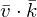，另一個是**叉乘(Cross Product)**，記作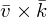。

#### 點乘(Dot Product)

兩個向量的點乘等於它們的數乘結果乘以兩個向量之間夾角的餘弦值。聽起來有點費解，先看一下公式：

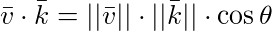

它們之間的夾角我們記作。為什麼這很有用？想象如果和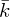都是單位向量，它們的長度等於1。公式會有效簡化成：

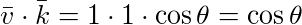

現在點乘**只**和兩個向量的角度有關。你也許記得當90度的餘弦是0，0度的餘弦是1。使用點乘可以很容易測試兩個向量是否正交(Orthogonal)或平行(正交意味著兩個向量互為**直角**)。你可能想要了解更多的關於正弦或餘弦的知識，我推薦你看[可汗學院](https://www.khanacademy.org/math/trigonometry/basic-trigonometry/basic_trig_ratios/v/basic-trigonometry)的基礎三角學視頻。

!!! Important

	你可以計算兩個非單位向量的角度，但是你必須除把結果以兩個向量的長度，再除以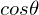。

所以，我們如何計算點乘？點乘是按分量逐個相乘，然後再把結果相加。兩個單位向量點乘就像這樣(你可以用兩個長度為1的驗證)：

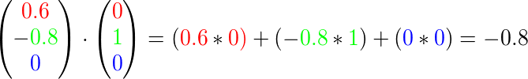

計算兩個單位餘弦的角度，我們使用反餘弦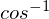 ，結果是143.1度。現在我們很快就計算出了兩個向量的角度。點乘在計算光照的時候會很有用。

#### 叉乘(Cross Product)

叉乘只在3D空間有定義，它需要兩個不平行向量作為輸入，生成正交於兩個輸入向量的第三個向量。如果輸入的兩個向量也是正交的，那麼叉乘的結果將會返回3個互相正交的向量。接下來的教程中，這很有用。下面的圖片展示了3D空間中叉乘的樣子：


不同於其他運算，如果你沒有鑽研過線性代數，會覺得叉乘很反直覺，所以最好記住公式，就沒問題(記不住也沒問題)。下面你會看到兩個正交向量A和B叉乘結果：

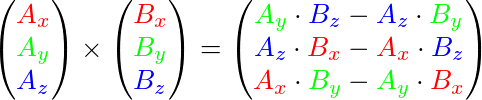

就像你所看到的，看起來毫無頭緒。可如果你這麼做了，你會得到第三個向量，它正交於你的輸入向量。

## 矩陣(Matrix)

現在我們已經討論了向量的全部內容，是時候看看矩陣了！矩陣簡單說是一個矩形的數字、符號或表達式數組。矩陣中每一項叫做矩陣的**元素(Element)**。下面是一個2×3矩陣的例子：

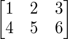

矩陣可以通過(i, j)進行索引，i是行，j是列，這就是上面的矩陣叫做2×3矩陣的原因(3列2行，也叫做矩陣的**維度(Dimension)**)。這與你在索引2D圖像時的(x, y)相反，獲取4的索引是(2, 1)(第二行，第一列)(譯註：如果是圖像索引應該是(1, 2)，先算列，再算行)。

關於矩陣基本也就是這些了，它就是矩形數學表達式陣列。矩陣也有非常漂亮的數學屬性，就跟向量一樣。矩陣有幾個運算，叫做：矩陣加法、減法和乘法。

### 矩陣的加減

矩陣與標量的加減如下所示：

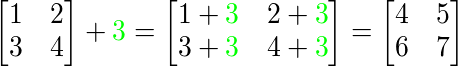

標量值要加到矩陣的每一個元素上。矩陣與標量的減法也是同樣的：

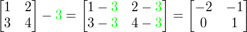

矩陣與矩陣之間的加減就是兩個矩陣對應元素的加減運算，所以總體的規則和與標量運算是差不多的，只不過在相同索引下的元素才能進行運算。這也就是說加法和減法只在同維度的矩陣中是有定義的。一個3×2矩陣和一個2×3矩陣(或一個3×3矩陣與4×4矩陣)是不能進行加減的。我們看看兩個2×2矩陣是怎樣加減的：

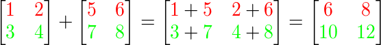

同樣的法則也適用於減法：

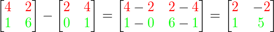

### 矩陣的數乘(Matrix-scalar Products)

和矩陣與標量的加減一樣，矩陣與標量之間的乘法也是矩陣的每一個元素分別乘以該標量。下面的例子展示了乘法的過程：

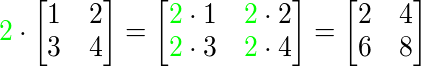

現在我們也就能明白為什麼一個單獨的數字要叫做標量(Scalar)了。簡單來說，標量就是用它的值縮放(Scale)矩陣的所有元素(譯註：注意Scalar是由Scale + -ar演變過來的)。前面的例子裡，所有的元素都被放大2。

到目前為止都還好，我們的例子都不復雜。不過矩陣與矩陣的乘法就不一樣了。

### 矩陣相乘(Matrix-matrix Multiplication)

矩陣之間的乘法不見得有多複雜，但的確很難讓人適應。矩陣乘法基本上意味著遵照規定好的法則進行相乘。當然，相乘還有一些限制：

1. 只有當左側矩陣的列數與右側矩陣的行數相等，兩個矩陣才能相乘。
2. 矩陣相乘不遵守**交換律(Commutative)**，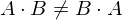。

我們先看一個兩個2×2矩陣相乘的例子：

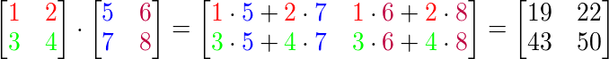

現在你可能會在想了：我勒個去，剛剛到底發生了什麼? 矩陣的乘法是一系列乘法和加法組合的結果，它使用到了左側矩陣的行和右側矩陣的列。我們可以看下面的圖片：

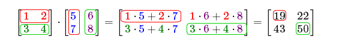

我們先把左側矩陣的行和右側矩陣的列拿出來。這些我們挑出來行和列決定著作為結果的2×2矩陣的輸出值。如果我們拿出來的是左矩陣的第一行，最終的值就會出現在作為結果的矩陣的第一行，如果我們拿出來的是右矩陣的第一列，最終值會出現在作為結果的矩陣的第一列。這正是紅框裡的情況。如果想計算結果矩陣右下角的值，我們要用第一個矩陣的第二行和第二個矩陣的第二列(譯註：簡單來說就是結果矩陣的元素的行取決於第一個矩陣，列取決於第二個矩陣)。

計算一項的結果值的方式是先計算左側矩陣對應行和右側矩陣對應列的第一個元素之積，然後是第二個，第三個，第四個等等，然後把所有的乘積相加，這就是結果了。現在我們就能解釋為什麼左側矩陣的列數必須和右側矩陣的行數相等了，如果不相等這一步的操作我們就無法完成了!

結果的矩陣的維度是(n, m)，n等於左側矩陣的行數，m等於右側矩陣的列數。

如果你在腦子裡想象出乘法有困難別擔心。用筆寫下來，如果遇到困難回頭看這頁的內容。隨著時間流逝，矩陣乘法對你來說會變成很自然的事。

我們用一個更大的例子來結束矩陣與矩陣乘法的討論。嘗試使用顏色來讓這個公式更容易理解。作為一個有用的練習，你可以自己回答這個乘法問題然後對比你的結果和圖中的這個(如果你用筆計算，你很快就能掌握它們)。

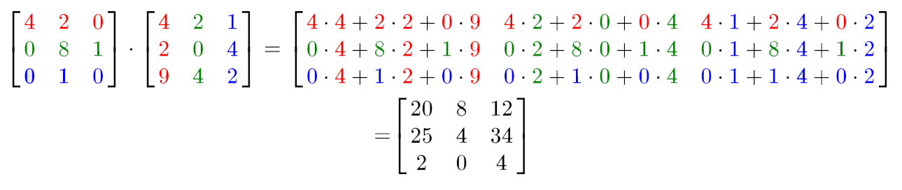

就像你所看到的那樣，矩陣與矩陣相乘複雜而容易犯錯(這就是我們通常讓計算機做這件事的原因)，而且當矩陣變大以後很快就會出現問題。如果你仍然希望瞭解更多，對矩陣的數學屬性感到好奇，我強烈推薦你看看[可汗學院](https://www.khanacademy.org/math/algebra2/algebra-matrices)的矩陣內容視頻。

不管怎樣，反正現在我們知道如何進行矩陣相乘了，我們可以開始瞭解好東西了。

## 矩陣與向量相乘

到目前，通過這些教程我們已經相當瞭解向量了。我們用向量來表示位置、顏色和紋理座標。讓我們進到兔子洞更深處：向量基本上就是一個**N×1**矩陣，N是向量分量的個數(也叫**N維(N-dimensional)**向量)。如果你仔細思考這個問題，會很有意思。向量和矩陣一樣都是一個數字序列，但是它只有1列。所以，這個新信息能如何幫助我們？如果我們有一個M×N矩陣，我們可以用這個矩陣乘以我們的N×1向量，因為我們的矩陣的列數等於向量的行數，所以它們就能相乘。

但是為什麼我們關心矩陣是否能夠乘以一個向量？有很多有意思的2D/3D變換本質上都是矩陣，而矩陣與我們的向量相乘會變換我們的向量。假如你仍然有些困惑，我們看一些例子，你很快就能明白了。

### 單位矩陣(Identity Matrix)

在OpenGL中，因為有一些原因我們通常使用4×4的變換矩陣，而其中最重要的原因就是因為每一個向量都有4個分量的。我們能想到的最簡單的變換矩陣就是**單位矩陣(Identity Matrix)**。單位矩陣是一個除了對角線以外都是0的N × N矩陣。就像你看到的，這個變換矩陣使一個向量完全不變：

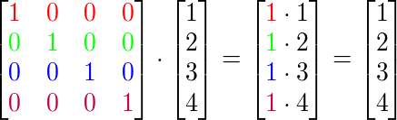

向量看起來完全沒動。從乘法法則來看很明顯：第一個結果分量是矩陣的第一行的每個對應分量乘以向量的每一個分量。因為每行的分量除了第一個都是0，可得: 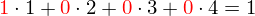，這對向量的其他3個分量同樣適用。

!!! Important

	你可能會奇怪一個沒變換的變換矩陣有什麼用？單位矩陣通常是生成其他變換矩陣的起點，如果我們深挖線性代數，這就是一個對證明定理、解線性方程非常有用的矩陣。

### 縮放(Scaling)

當我們對一個向量進行縮放的時候就是對向量的長度進行縮放，而它的方向保持不變。如果我們進行2或3維操作，那麼我們可以分別定義一個有2或3個縮放變量的向量，每個變量縮放一個軸(x、y或z)。

我們可以嘗試去縮放向量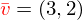。我們可以把向量沿著x軸縮放0.5，使它的寬度縮小為原來的二分之一；我們可以沿著y軸把向量的高度縮放為原來的兩倍。我們看看把向量縮放(0.5, 2)所獲得的是什麼樣的：


記住，OpenGL通常是在3D空間操作的，對於2D的情況我們可以把z軸縮放1這樣z軸的值就不變了。我們剛剛的縮放操作是**不均勻(Non-uniform)**縮放，因為每個軸的縮放因子(Scaling Factor)都不一樣。如果每個軸的縮放都一樣那麼就叫**均勻縮放(Uniform Scale)**。

我們下面設置一個變換矩陣來為我們提供縮放功能。我們從單位矩陣瞭解到，每個對角線元素乘以對應的向量分量。如果我們把1變為3會怎樣？這種情況，我們就把向量的每個分量乘以3了，這事實上就把向量縮放3。如果我們把縮放變量表示為我們可以為任意向量(x, y, z)定義一個縮放矩陣：

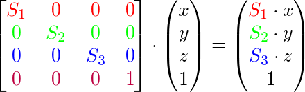

注意，第四個縮放的向量仍然是1，因為不會縮放3D空間中的w分量。w分量另有其他用途，在後面我們會看到。

### 平移(Translation)

**平移(Translation)**是在原來向量的基礎上加上另一個的向量從而獲得一個在不同位置的新向量的過程，這樣就基於平移向量**移動(Move)**了向量。我們已經討論了向量加法，所以你應該不會陌生。

和縮放矩陣一樣，在4×4矩陣上有幾個特別的位置用來執行特定的操作，對於平移來說它們是第四列最上面的3個值。如果我們把縮放向量表示為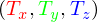我們就能把平移矩陣定義為:

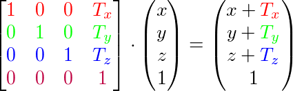

這樣是能工作的，因為所有的平移值都要乘以向量的w列，所以平移值會加到向量的原始座標上(想想矩陣乘法法則)。而如果你用3x3矩陣我們的平移值就沒地方放也沒地方乘了，所以是不行的。

!!! Important

	**齊次座標(Homogeneous coordinates)**

	向量的w分量也叫**齊次座標**。想要從齊次座標得到3D座標，我們可以把x、y和z座標除以w座標。我們通常不會注意這個問題，因為w分量通常是1.0。使用齊次座標有幾點好處：它允許我們在3D向量上進行平移(如果沒有w分量我們是不能平移向量的)，下一章我們會用w值創建3D圖像。
	
	如果一個向量的齊次座標是0，這個座標就是**方向向量(Direction Vector)**，因為w座標是0，這個向量就不能平移(譯註:這也就是我們說的不能平移一個方向)。

有了平移矩陣我們就可以在3個方向(x、y、z)上移動物體，它是我們的變換工具箱中非常有用的一個變換矩陣。

### 旋轉(Rotation)

上面幾個的變換內容相對容易理解，在2D或3D空間中也容易表示出來，但旋轉稍複雜些。如果你想知道旋轉矩陣是如何構造出來的，我推薦你去看可汗學院[線性代數](https://www.khanacademy.org/math/linear-algebra/matrix_transformations)視頻。

首先我們來定義一個向量的旋轉到底是什麼。2D或3D空間中點的旋轉用**角(Angle)**來表示。角可以是角度制或弧度制的，周角是360度或2 [PI](https://en.wikipedia.org/wiki/Pi)弧度。我個人更喜歡用角度，因為它們看起來更直觀。

!!! Important

	大多數旋轉函數需要用弧度制的角，但是角度制的角也可以很容易地轉化為弧度制：
	
	- 弧度轉角度：角度 = 弧度 * (180.0f / PI)
	- 角度轉弧度：弧度 = 角度 * (PI / 180.0f)
	
	PI約等於3.14159265359。

轉半圈會向右旋轉360/2 = 180度，向右旋轉1/5圈表示向右旋轉360/5 = 72度。這表明2D空間的向量是由向右旋轉72度得到的：


在3D空間中旋轉需要一個角**和**一個**旋轉軸(Rotation Axis)**。物體會沿著給定的旋轉軸旋轉特定角度。如果你想要更形象化的描述，可以試試向下看著一個特定的旋轉軸，同時將你的頭部旋轉一定角度。比如2D向量在3D空間中旋轉時，我們把旋轉軸設為z軸(嘗試想象這種情況)。

使用三角學就能把一個向量變換為一個經過旋轉特定角度的新向量。這通常是使用一系列正弦和餘弦各種巧妙的組合得到的(一般簡稱sin和cos)。當然，討論如何生成變換矩陣超出了這個教程的範圍。

旋轉矩陣在3D空間中每個單位軸都有不同定義，這個角度表示為：

沿x軸旋轉：

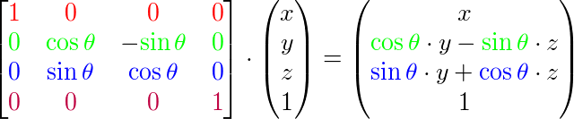

沿y軸旋轉：

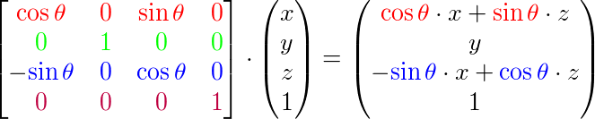

沿z軸旋轉：

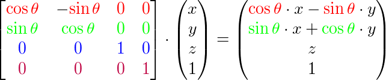

利用旋轉矩陣我們可以把我們的位置向量(Position Vectors)沿一個或多個軸進行旋轉。也可以把多個矩陣結合起來，比如先沿著X軸旋轉再沿著Y軸旋轉。但是這會很快導致一個問題——**萬向節死鎖(Gimbal Lock，可以看看[這個視頻](https://www.youtube.com/watch?v=zc8b2Jo7mno)來了解)**。我們不會討論它的細節，但是一個更好的解決方案是沿著任意軸比如(0.662, 0.2, 0.7222)(注意，這是個單位向量)旋轉，而不是使用一系列旋轉矩陣的組合。這樣一個(超級麻煩)的矩陣是存在的，下面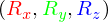代表任意旋轉軸：

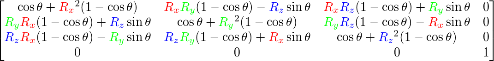

在數學上討論如何生成這樣的矩陣仍然超出了本節內容。但是記住，即使這樣一個矩陣也不能完全解決萬向節死鎖問題(儘管會極大地避免)。避免萬向節死鎖的真正解決方案是使用**四元數(Quaternion)**，它不僅安全，而且計算更加友好。有關四元數會在後面的教程中討論。

### 矩陣的組合

使用矩陣變換的真正力量在於，根據矩陣之前的乘法，我們可以把多個變換組合到一個矩陣中。讓我們看看我們是否能生成一個多個變換相結合而成的變換矩陣。我們有一個頂點(x, y, z)，我們希望將其縮放2倍，然後用位移(1, 2, 3)來平移它。我們需要一個平移和縮放矩陣來完成這些變換。結果的變換矩陣看起來像這樣：

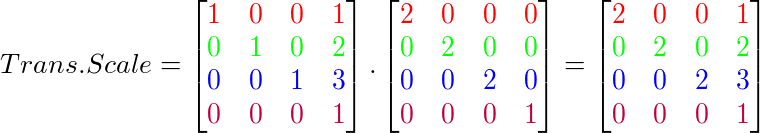

注意，當矩陣相乘時我們先寫平移再寫縮放變換的。矩陣乘法是不可交換的，這意味著它們的順序很重要。當矩陣相乘時，在最右邊的矩陣是第一個乘以向量的，所以你應該從右向左讀這個乘法。我們建議您在組合矩陣時，先進行縮放操作，然後是旋轉，最後才是平移，否則它們會(消極地)互相影響。比如，如果你先平移然後縮放，平移的向量也會同樣被縮放(譯註：比如向某方向移動2米，2米也許會被縮放成1米)！

將我們的矢量左乘最終的變換矩陣會得到以下結果：

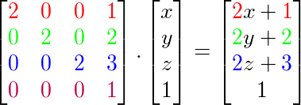

不錯！向量先縮放2倍，然後平移了(1, 2, 3)個單位。

## 實踐

現在我們已經解釋了所有變換背後的理論，是時候將這些知識利用起來了。OpenGL沒有任何自帶的矩陣和向量形式，所以我們必須自己定義數學類和方法。在這個教程中我們更願意抽象所有的數學細節，使用已經做好了的數學庫。幸運的是有個使用簡單的專門為OpenGL量身定做的數學庫，那就是GLM。

### GLM

GLM是Open**GL** **M**athematics的縮寫，它是一個只有頭文件的庫，也就是說我們只需包含合適的頭文件就行了；不用鏈接和編譯。GLM可以從他們的[網站](http://glm.g-truc.net/0.9.5/index.html)上下載。把頭文件的根目錄複製到你的`includes`文件夾，然後你就可以使用這個庫了。


我們需要的GLM的大多數功能都可以從下面這3個頭文件中找到：

```c++
#include <glm/glm.hpp>
#include <glm/gtc/matrix_transform.hpp>
#include <glm/gtc/type_ptr.hpp>
```

我們來看看是否可以利用我們剛學的變換知識把一個向量(1, 0, 0)平移(1, 1, 0)個單位(注意，我們把它定義為一個glm::vec4類型的值，其中齊次座標我們設定為1.0)：

```c++
glm::vec4 vec(1.0f, 0.0f, 0.0f, 1.0f);
glm::mat4 trans;
trans = glm::translate(trans, glm::vec3(1.0f, 1.0f, 0.0f));
vec = trans * vec;
std::cout << vec.x << vec.y << vec.z << std::endl;
```

我們先用GLM內建的向量類定義一個叫做`vec`的向量。接下來我們定義一個`mat4`類型的`trans`，默認是4×4單位矩陣。接下來我們創建一個變換矩陣，我們是把單位矩陣和一個平移向量傳遞給`glm::translate`函數來完成這個工作的(然後用給定的矩陣乘以平移矩陣就能獲得最後需要的矩陣)。

之後我們把向量乘以平移矩陣並且輸出最後的結果。如果我們仍然記得平移矩陣是如何工作的話，得到的向量應該是(1 + 1, 0 + 1, 0 + 0)，也就是(2, 1, 0)。這個代碼片段將會輸出210，所以這個平移矩陣是正確的。

我們來做些更有意思的事情，讓我們來旋轉和縮放之前教程中的那個箱子。首先我們把箱子逆時針旋轉90度。然後縮放0.5倍，使它變成原來的二分之一。我們先來創建變換矩陣：

```c++
glm::mat4 trans;
trans = glm::rotate(trans, 90.0f, glm::vec3(0.0, 0.0, 1.0));
trans = glm::scale(trans, glm::vec3(0.5, 0.5, 0.5));  
```

首先，我們把箱子在每個軸縮放到0.5倍，然後沿Z軸旋轉90度。注意有紋理的那面矩形是在XY平面上的，我們需要把它繞著z軸旋轉。因為我們把這個矩陣傳遞給了GLM的每個函數，GLM會自動將矩陣相乘，返回的結果是一個包括了多個變換的變換矩陣。

!!! Attention

	有些GLM版本接收的是弧度而不是角度，這種情況下你可以用`glm::radians(90.0f)`將角度轉換為弧度。

下一個大問題是：如何把矩陣傳遞給著色器？我們在前面簡單提到過GLSL裡的`mat4`類型。所以我們改寫頂點著色器來接收一個`mat4`的uniform變量，然後再用矩陣uniform乘以位置向量：

```c++
#version 330 core
layout (location = 0) in vec3 position;
layout (location = 1) in vec3 color;
layout (location = 2) in vec2 texCoord;

out vec3 ourColor;
out vec2 TexCoord;
  
uniform mat4 transform;

void main()
{
    gl_Position = transform * vec4(position, 1.0f);
    ourColor = color;
    TexCoord = vec2(texCoord.x, 1.0 - texCoord.y);
} 
```

!!! Attention

	GLSL也有`mat2`和`mat3`類型從而允許了像向量一樣的混合運算。前面提到的所有數學運算(比如標量-矩陣乘法，矩陣-向量乘法和矩陣-矩陣乘法)在矩陣類型裡都可以使用。當出現特殊的矩陣運算的時候我們會特別說明發生了什麼的。

在把位置向量傳給`gl_Position`之前，我們添加一個uniform，並且用變換矩陣乘以它。我們的箱子現在應該是原來的二分之一大小並旋轉了90度(向左傾斜)。當然，我們仍需要把變換矩陣傳遞給著色器：

```c++
GLuint transformLoc = glGetUniformLocation(ourShader.Program, "transform");
glUniformMatrix4fv(transformLoc, 1, GL_FALSE, glm::value_ptr(trans));
```

我們首先請求uniform變量的地址，然後用有`Matrix4fv`後綴的`glUniform`函數把矩陣數據發送給著色器。第一個參數你現在應該很熟悉了，它是uniform的地址(Location)。第二個參數告訴OpenGL我們將要發送多少個矩陣，目前是1。第三個參數詢問我們我們是否希望對我們的矩陣進行置換(Transpose)，也就是說交換我們矩陣的行和列。OpenGL開發者通常使用一種內部矩陣佈局叫做**以列為主順序的(Column-major Ordering)**佈局。GLM已經是用以列為主順序定義了它的矩陣，所以並不需要置換矩陣，我們填`GL_FALSE`、最後一個參數是實際的矩陣數據，但是GLM並不是把它們的矩陣儲存為OpenGL所希望的那種，因此我們要先用GLM的自帶的函數`value_ptr`來變換這些數據。

我們創建了一個變換矩陣，在頂點著色器中聲明瞭一個uniform，並把矩陣發送給了著色器，著色器會變換我們的頂點座標。最後的結果應該看起來像這樣：


完美！我們的箱子向左側傾斜，是原來的二分之一大小，看來變換成功了。我們現在做些更有意思的，看看我們是否可以讓箱子隨著時間旋轉，我們還會重新把箱子放在窗口的左下角。要讓箱子隨著時間推移旋轉，我們必須在遊戲循環中更新變換矩陣，因為它需要在每一次渲染迭代中被更新。我們使用GLFW的時間函數來獲取不同時間的角度：

```c++
glm::mat4 trans;
trans = glm::translate(trans, glm::vec3(0.5f, -0.5f, 0.0f));
trans = glm::rotate(trans,(GLfloat)glfwGetTime() * 50.0f, glm::vec3(0.0f, 0.0f, 1.0f));
```

要記住的是前面的例子中我們可以在任何地方聲明變換矩陣，但是現在我們必須在每一次迭代中創建它，從而保證我們能夠更新旋轉矩陣。這也就意味著我們不得不在每次迭代中中重新創建變換矩陣。通常在渲染場景的時候，我們也會有多個在每次渲染迭代中都用新的值重新創建的變換矩陣

在這裡我們先把箱子圍繞原點(0, 0, 0)旋轉，之後，我們把旋轉過後的箱子平移到屏幕的右下角。記住，實際的變換順序應該從下向上閱讀：儘管在代碼中我們先平移再旋轉，實際的變換卻是先應用旋轉然後平移的。明白所有這些變換的組合，並且知道它們是如何應用到物體上的並不簡單。只有嘗試和實驗這些變換你才能快速地掌握它們。

如果你做對了，你將看到下面的結果：

<video src="http://learnopengl.com/video/getting-started/transformations.mp4" controls="controls">
</video>

這就是我們剛剛做到的！一個平移過的箱子，它會一直轉，一個變換矩陣就做到了！現在你可以明白為什麼矩陣在圖形領域是一個如此重要的工具了。我們可以定義一個無限數量的變換，把它們組合為一個單獨的矩陣，如果願意的話我們還可以重複使用它。在著色器中使用矩陣可以省去重新定義頂點數據的力氣，它也能夠節省處理時間，因為我們沒有一直重新發送我們的數據(這是個非常慢的過程)。

如果你沒有得到正確的結果，或者你有哪兒不清楚的地方。可以看[源碼](http://learnopengl.com/code_viewer.php?code=getting-started/transformations)和[頂點](http://learnopengl.com/code_viewer.php?code=getting-started/transformations&type=vertex)、[片段](http://learnopengl.com/code_viewer.php?code=getting-started/transformations&type=fragment)著色器。

下個教程中，我們會討論怎樣使用矩陣為頂點定義不同的座標空間。這將是我們進入實時3D圖像的第一步！

## 練習

- 使用應用在箱子上的最後的變換，嘗試將其改變成先旋轉，後平移。看看發生了什麼，試著想想為什麼會發生這樣的事情: [參考解答](http://learnopengl.com/code_viewer.php?code=getting-started/transformations-exercise1)
- 嘗試著再次調用`glDrawElements`畫出第二個箱子，但是**只能**使用變換將其擺放在不同的位置。保證這個箱子被擺放在窗口的左上角，並且會不斷的縮放(而不是旋轉)。使用sin函數在這裡會很有用；注意使用sin函數取到負值時會導致物體被翻轉: [參考解答](http://learnopengl.com/code_viewer.php?code=getting-started/transformations-exercise2)