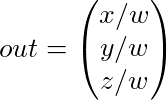

# 座標系統(Coordinate System)

// TODO 翻譯太生硬，可能還要重寫。並且可能還有漏掉的地方。  
// 簡單說下問題，供再次校對的時候參考:  
// 1.術語翻譯不統一  
// 2.從句還保留著英語語序，翻譯出來很奇怪  
// 3.To do很多未翻譯出來  
// 4.某些地方很不通順，特別是遇上連詞的時候  

原文     | [Coordinate Systems](http://learnopengl.com/#!Getting-started/Coordinate-Systems)
      ---|---
作者     | JoeyDeVries
翻譯     | linkoln
校對     | Geequlim, Meow J

在上一個教程中，我們學習瞭如何有效地利用矩陣變換來對所有頂點進行轉換。OpenGL希望在所有頂點著色器運行後，所有我們可見的頂點都變為標準化設備座標(Normalized Device Coordinate, NDC)。也就是說，每個頂點的x，y，z座標都應該在-1.0到1.0之間，超出這個座標範圍的頂點都將不可見。我們通常會自己設定一個座標的範圍，之後再在頂點著色器中將這些座標轉換為標準化設備座標。然後將這些標準化設備座標傳入光柵器(Rasterizer)，再將他們轉換為屏幕上的二維座標或像素。

將座標轉換為標準化設備座標，接著再轉化為屏幕座標的過程通常是分步，也就是類似於流水線那樣子，實現的，在流水線裡面我們在將對象轉換到屏幕空間之前會先將其轉換到多個座標系統。將對象的座標轉換到幾個過渡座標系(Intermediate Coordinate System)的優點在於，在這些特定的座標系統中進行一些操作或運算更加方便和容易，這一點很快將會變得很明顯。對我們來說比較重要的總共有5個不同的座標系統：

 - 局部空間(Local Space，或者稱為物體空間(Object Space))
 - 世界空間(World Space)
 - 觀察空間(View Space，或者稱為視覺空間(Eye Space))
 - 裁剪空間(Clip Space)
 - 屏幕空間(Screen Space)
 
這些就是我們將所有頂點轉換為片段之前，頂點需要處於的不同的狀態。

你現在可能對什麼是空間或座標系到底是什麼感到困惑，所以接下來我們將會通過展示完整的圖片來解釋每一個座標系實際做了什麼。

### 整體概述

為了將座標從一個座標系轉換到另一個座標系，我們需要用到幾個轉換矩陣，最重要的幾個分別是**模型(Model)**、**視圖(View)**、**投影(Projection)**三個矩陣。首先，頂點座標開始於**局部空間(Local Space)**，稱為**局部座標(Local Coordinate)**，然後經過**世界座標(World Coordinate)**，**觀察座標(View Coordinate)**，**裁剪座標(Clip Coordinate)**，並最後以**屏幕座標(Screen Coordinate)**結束。下面的圖示顯示了整個流程及各個轉換過程做了什麼：


 1. 局部座標是對象相對於局部原點的座標；也是對象開始的座標。
 2. 將局部座標轉換為世界座標，世界座標是作為一個更大空間範圍的座標系統。這些座標是相對於世界的原點的。
 3. 接下來我們將世界座標轉換為觀察座標，觀察座標是指以攝像機或觀察者的角度觀察的座標。
 4. 在將座標處理到觀察空間之後，我們需要將其投影到裁剪座標。裁剪座標是處理-1.0到1.0範圍內並判斷哪些頂點將會出現在屏幕上。
 5. 最後，我們需要將裁剪座標轉換為屏幕座標，我們將這一過程成為**視口變換(Viewport Transform)**。視口變換將位於-1.0到1.0範圍的座標轉換到由`glViewport`函數所定義的座標範圍內。最後轉換的座標將會送到光柵器，由光柵器將其轉化為片段。


你可能瞭解了每個單獨的座標空間的作用。我們之所以將頂點轉換到各個不同的空間的原因是有些操作在特定的座標系統中才有意義且更方便。例如，當修改對象時，如果在局部空間中則是有意義的；當對對象做相對於其它對象的位置的操作時，在世界座標系中則是有意義的；等等這些。如果我們願意，本可以定義一個直接從局部空間到裁剪空間的轉換矩陣，但那樣會失去靈活性。接下來我們將要更仔細地討論各個座標系。

### 局部空間(Local Space)

局部空間是指對象所在的座標空間，例如，對象最開始所在的地方。想象你在一個模型建造軟件(比如說Blender)中創建了一個立方體。你創建的立方體的原點有可能位於(0，0，0)，即使有可能在最後的應用中位於完全不同的另外一個位置。甚至有可能你創建的所有模型都以(0，0，0)為初始位置，然而他們會在世界的不同位置。則你的模型的所有頂點都是在**局部**空間：他們相對於你的對象來說都是局部的。

我們一直使用的那個箱子的座標範圍為-0.5到0.5，設定(0, 0)為它的原點。這些都是局部座標。


### 世界空間(World Space)

如果我們想將我們所有的對象導入到程序當中，它們有可能會全擠在世界的原點上(0，0，0)，然而這並不是我們想要的結果。我們想為每一個對象定義一個位置，從而使對象位於更大的世界當中。世界空間中的座標就如它們聽起來那樣：是指頂點相對於(遊戲)世界的座標。物體變換到的最終空間就是世界座標系，並且你會想讓這些物體分散開來擺放(從而顯得更真實)。對象的座標將會從局部座標轉換到世界座標；該轉換是由**模型矩陣(Model Matrix)**實現的。

模型矩陣是一種轉換矩陣，它能通過對對象進行平移、縮放、旋轉來將它置於它本應該在的位置或方向。你可以想象一下，我們需要轉換一棟房子，通過將它縮小(因為它在局部座標系中顯得太大了)，將它往郊區的方向平移，然後沿著y軸往座標旋轉。經過這樣的變換之後，它將恰好能夠與鄰居的房子重合。你能夠想到上一節講到的利用模型矩陣將各個箱子放置到這個屏幕上；我們能夠將箱子中的局部座標轉換為觀察座標或世界座標。

### 觀察空間(View Space)

觀察空間經常被人們稱之OpenGL的**攝像機(Camera)**(所以有時也稱為攝像機空間(Camera Space)或視覺空間(Eye Space))。觀察空間就是將對象的世界空間的座標轉換為觀察者視野前面的座標。因此觀察空間就是從攝像機的角度觀察到的空間。而這通常是由一系列的平移和旋轉的組合來平移和旋轉場景從而使得特定的對象被轉換到攝像機前面。這些組合在一起的轉換通常存儲在一個**觀察矩陣(View Matrix)**裡，用來將世界座標轉換到觀察空間。在下一個教程我們將廣泛討論如何創建一個這樣的觀察矩陣來模擬一個攝像機。

### 裁剪空間(Clip Space)

在一個頂點著色器運行的最後，OpenGL期望所有的座標都能落在一個給定的範圍內，且任何在這個範圍之外的點都應該被裁剪掉(Clipped)。被裁剪掉的座標就被忽略了，所以剩下的座標就將變為屏幕上可見的片段。這也就是**裁剪空間**名字的由來。

因為將所有可見的座標都放置在-1.0到1.0的範圍內不是很直觀，所以我們會指定自己的座標集(Coordinate Set)並將它轉換回標準化設備座標系，就像OpenGL期望它做的那樣。

為了將頂點座標從觀察空間轉換到裁剪空間，我們需要定義一個**投影矩陣(Projection Matrix)**，它指定了座標的範圍，例如，每個維度都是從-1000到1000。投影矩陣接著會將在它指定的範圍內的座標轉換到標準化設備座標系中(-1.0，1.0)。所有在範圍外的座標在-1.0到1.0之間都不會被繪製出來並且會被裁剪。在投影矩陣所指定的範圍內，座標(1250，500，750)將是不可見的，這是由於它的x座標超出了範圍，隨後被轉化為在標準化設備座標中座標值大於1.0的值並且被裁剪掉。

!!! Important

    如果只是片段的一部分例如三角形，超出了裁剪體積(Clipping Volume)，則OpenGL會重新構建三角形以使一個或多個三角形能適應在裁剪範圍內。

由投影矩陣創建的**觀察區域(Viewing Box)**被稱為**平截頭體(Frustum)**，且每個出現在平截頭體範圍內的座標都會最終出現在用戶的屏幕上。將一定範圍內的座標轉化到標準化設備座標系的過程(而且它很容易被映射到2D觀察空間座標)被稱之為**投影(Projection)**，因為使用投影矩陣能將3維座標**投影(Project)**到很容易映射的2D標準化設備座標系中。

一旦所有頂點被轉換到裁剪空間，最終的操作——**透視劃分(Perspective Division)**將會執行，在這個過程中我們將位置向量的x，y，z分量分別除以向量的齊次w分量；透視劃分是將4維裁剪空間座標轉換為3維標準化設備座標。這一步會在每一個頂點著色器運行的最後被自動執行。

在這一階段之後，座標經過轉換的結果將會被映射到屏幕空間(由`glViewport`設置)且被轉換成片段。

投影矩陣將觀察座標轉換為裁剪座標的過程採用兩種不同的方式，每種方式分別定義自己的平截頭體。我們可以創建一個正射投影矩陣(Orthographic Projection Matrix)或一個透視投影矩陣(Perspective Projection Matrix)。

#### 正射投影(Orthographic Projection)

正射投影矩陣定義了一個類似立方體的平截頭體，指定了一個裁剪空間，每一個在這空間外面的頂點都會被裁剪。創建一個正射投影矩陣需要指定可見平截頭體的寬、高和長度。所有在使用正射投影矩陣轉換到裁剪空間後如果還處於這個平截頭體裡面的座標就不會被裁剪。它的平截頭體看起來像一個容器：


上面的平截頭體定義了由寬、高、**近**平面和**遠**平面決定的可視的座標系。任何出現在近平面前面或遠平面後面的座標都會被裁剪掉。正視平截頭體直接將平截頭體內部的頂點映射到標準化設備座標系中，因為每個向量的w分量都是不變的；如果w分量等於1.0，則透視劃分不會改變座標的值。

為了創建一個正射投影矩陣，我們利用GLM的構建函數`glm::ortho`：

```c++
glm::ortho(0.0f, 800.0f, 0.0f, 600.0f, 0.1f, 100.0f);
```

前兩個參數指定了平截頭體的左右座標，第三和第四參數指定了平截頭體的底部和上部。通過這四個參數我們定義了近平面和遠平面的大小，然後第五和第六個參數則定義了近平面和遠平面的距離。這個指定的投影矩陣將處於這些x，y，z範圍之間的座標轉換到標準化設備座標系中。

正射投影矩陣直接將座標映射到屏幕的二維平面內，但實際上一個直接的投影矩陣將會產生不真實的結果，因為這個投影沒有將**透視(Perspective)**考慮進去。所以我們需要**透視投影**矩陣來解決這個問題。

#### 透視投影(Perspective Projection)

如果你曾經體驗過**實際生活**給你帶來的景象，你就會注意到離你越遠的東西看起來更小。這個神奇的效果我們稱之為透視。透視的效果在我們看一條無限長的高速公路或鐵路時尤其明顯，正如下面圖片顯示的那樣:


正如你看到的那樣，由於透視的原因，平行線似乎在很遠的地方看起來會相交。這正是透視投影想要模仿的效果，它是使用透視投影矩陣來完成的。這個投影矩陣不僅將給定的平截頭體範圍映射到裁剪空間，同樣還修改了每個頂點座標的w值，從而使得離觀察者越遠的頂點座標w分量越大。被轉換到裁剪空間的座標都會在-w到w的範圍之間(任何大於這個範圍的對象都會被裁剪掉)。OpenGL要求所有可見的座標都落在-1.0到1.0範圍內從而作為最後的頂點著色器輸出，因此一旦座標在裁剪空間內，透視劃分就會被應用到裁剪空間座標：



每個頂點座標的分量都會除以它的w分量，得到一個距離觀察者的較小的頂點座標。這是也是另一個w分量很重要的原因，因為它能夠幫助我們進行透射投影。最後的結果座標就是處於標準化設備空間內的。如果你對研究正射投影矩陣和透視投影矩陣是如何計算的很感興趣(且不會對數學感到恐懼的話)我推薦[這篇由Songho寫的文章](http://www.songho.ca/opengl/gl_projectionmatrix.html)。

在GLM中可以這樣創建一個透視投影矩陣：

```c++
glm::mat4 proj = glm::perspective(45.0f, (float)width/(float)height, 0.1f, 100.0f);
```

`glm::perspective`所做的其實就是再次創建了一個定義了可視空間的大的**平截頭體**，任何在這個平截頭體的對象最後都不會出現在裁剪空間體積內，並且將會受到裁剪。一個透視平截頭體可以被可視化為一個不均勻形狀的盒子，在這個盒子內部的每個座標都會被映射到裁剪空間的點。一張透視平截頭體的照片如下所示：


它的第一個參數定義了**fov**的值，它表示的是**視野(Field of View)**，並且設置了觀察空間的大小。對於一個真實的觀察效果，它的值經常設置為45.0，但想要看到更多結果你可以設置一個更大的值。第二個參數設置了寬高比，由視口的高除以寬。第三和第四個參數設置了平截頭體的近和遠平面。我們經常設置近距離為0.1而遠距離設為100.0。所有在近平面和遠平面的頂點且處於平截頭體內的頂點都會被渲染。

!!! Important

	當你把透視矩陣的*near*值設置太大時(如10.0)，OpenGL會將靠近攝像機的座標都裁剪掉(在0.0和10.0之間)，這會導致一個你很熟悉的視覺效果：在太過靠近一個物體的時候視線會直接穿過去。

當使用正射投影時，每一個頂點座標都會直接映射到裁剪空間中而不經過任何精細的透視劃分(它仍然有進行透視劃分，只是w分量沒有被操作(它保持為1)因此沒有起作用)。因為正射投影沒有使用透視，遠處的對象不會顯得小以產生神奇的視覺輸出。由於這個原因，正射投影主要用於二維渲染以及一些建築或工程的應用，或者是那些我們不需要使用投影來轉換頂點的情況下。某些如Blender的進行三維建模的軟件有時在建模時會使用正射投影，因為它在各個維度下都更準確地描繪了每個物體。下面你能夠看到在Blender裡面使用兩種投影方式的對比：


你可以看到使用透視投影的話，遠處的頂點看起來比較小，而在正射投影中每個頂點距離觀察者的距離都是一樣的。

### 把它們都組合到一起

我們為上述的每一個步驟都創建了一個轉換矩陣：模型矩陣、觀察矩陣和投影矩陣。一個頂點的座標將會根據以下過程被轉換到裁剪座標：


注意每個矩陣被運算的順序是相反的(記住我們需要從右往左乘上每個矩陣)。最後的頂點應該被賦予頂點著色器中的`gl_Position`且OpenGL將會自動進行透視劃分和裁剪。

!!! Important

	**然後呢？**

	頂點著色器的輸出需要所有的頂點都在裁剪空間內，而這是我們的轉換矩陣所做的。OpenGL然後在裁剪空間中執行透視劃分從而將它們轉換到標準化設備座標。OpenGL會使用`glViewPort`內部的參數來將標準化設備座標映射到屏幕座標，每個座標都關聯了一個屏幕上的點(在我們的例子中屏幕是800 *600)。這個過程稱為視口轉換。

這一章的主題可能會比較難理解，如果你仍然不確定每個空間的作用的話，你也不必太擔心。接下來你會看到我們是怎樣好好運用這些座標空間的並且會有足夠的展示例子在接下來的教程中。

## 進入三維

既然我們知道了如何將三維座標轉換為二維座標，我們可以開始將我們的對象展示為三維對象而不是目前我們所展示的缺胳膊少腿的二維平面。

在開始進行三維畫圖時，我們首先創建一個模型矩陣。這個模型矩陣包含了平移、縮放與旋轉，我們將會運用它來將對象的頂點轉換到全局世界空間。讓我們平移一下我們的平面，通過將其繞著x軸旋轉使它看起來像放在地上一樣。這個模型矩陣看起來是這樣的：

```c++
glm::mat4 model;
model = glm::rotate(model, -55.0f, glm::vec3(1.0f, 0.0f, 0.0f));
```

通過將頂點座標乘以這個模型矩陣我們將該頂點座標轉換到世界座標。我們的平面看起來就是在地板上的因此可以代表真實世界的平面。

接下來我們需要創建一個觀察矩陣。我們想要在場景裡面稍微往後移動以使得對象變成可見的(當在世界空間時，我們位於原點(0,0,0))。要想在場景裡面移動，思考下面的問題：

- 將攝像機往後移動跟將整個場景往前移是一樣的。
 
這就是觀察空間所做的，我們以相反於移動攝像機的方向移動整個場景。因為我們想要往後移動，並且OpenGL是一個右手座標系(Right-handed System)所以我們沿著z軸的負方向移動。我們會通過將場景沿著z軸正方向平移來實現這個。它會給我們一種我們在往後移動的感覺。

!!! Important

	**右手座標系(Right-handed System)**

	按照約定，OpenGL是一個右手座標系。最基本的就是說正x軸在你的右手邊，正y軸往上而正z軸是往後的。想象你的屏幕處於三個軸的中心且正z軸穿過你的屏幕朝向你。座標系畫起來如下：

	

	為了理解為什麼被稱為右手座標系，按如下的步驟做：

	- 張開你的右手使正y軸沿著你的手往上。
	- 使你的大拇指往右。
	- 使你的食指往上。
	- 向下90度彎曲你的中指。 

如果你都正確地做了，那麼你的大拇指朝著正x軸方向，食指朝著正y軸方向，中指朝著正z軸方向。如果你用左手來做這些動作，你會發現z軸的方向是相反的。這就是有名的左手座標系，它被DirectX廣泛地使用。注意在標準化設備座標系中OpenGL使用的是左手座標系(投影矩陣改變了慣用手的習慣)。

在下一個教程中我們將會詳細討論如何在場景中移動。目前的觀察矩陣是這樣的：

```c++
glm::mat4 view;
// 注意，我們將矩陣向我們要進行移動場景的反向移動。
view = glm::translate(view, glm::vec3(0.0f, 0.0f, -3.0f)); 
```

最後我們需要做的是定義一個投影矩陣。我們想要在我們的場景中使用透視投影所以我們聲明的投影矩陣是像這樣的：

```c++
glm::mat4 projection;
projection = glm::perspective(45.0f, screenWidth / screenHeight, 0.1f, 100.0f);
```

!!! Attention

	再重複一遍，在glm指定角度的時候要注意。這裡我們將參數fov設置為45度，但有些GLM的實現是將fov當成弧度，在這種情況你需要使用`glm::radians(45.0)`來設置。

既然我們創建了轉換矩陣，我們應該將它們傳入著色器。首先，讓我們在頂點著色器中聲明一個單位轉換矩陣然後將它乘以頂點座標：

```c++
#version 330 core
layout (location = 0) in vec3 position;
...
uniform mat4 model;
uniform mat4 view;
uniform mat4 projection;

void main()
{
    // 注意從右向左讀
    gl_Position = projection * view * model * vec4(position, 1.0f);
    ...
}
```

我們應該將矩陣傳入著色器(這通常在每次渲染的時候即轉換矩陣將要改變的時候完成)：

```c++
GLint modelLoc = glGetUniformLocation(ourShader.Program, "model"));
glUniformMatrix4fv(modelLoc, 1, GL_FALSE, glm::value_ptr(model));
... // 觀察矩陣和投影矩陣與之類似
```

現在我們的頂點座標通過模型、觀察和投影矩陣來轉換，最後的對象應該是：

 - 往後向地板傾斜。
 - 離我們有點距離。
 - 由透視展示(頂點越遠，變得越小)。

讓我們檢查一下結果是否滿足這些要求：


它看起來就像是一個三維的平面，是靜止在一些虛構的地板上的。如果你不是得到相同的結果，請檢查下完整的[源代碼](http://learnopengl.com/code_viewer.php?code=getting-started/cube_vertices) 以及[頂點](http://learnopengl.com/code_viewer.php?code=getting-started/transform&type=vertex)和[片段](http://learnopengl.com/code_viewer.php?code=getting-started/transform&type=fragment)著色器。

## 更多的3D

到目前為止，我們在二維平面甚至在三維空間中畫圖，所以讓我們採取大膽的方式來將我們的二維平面擴展為三維立方體。要渲染一個立方體，我們一共需要36個頂點(6個面 x 每個面有2個三角形組成 x 每個三角形有3個頂點)，這36個頂點的位置你可以[從這裡獲取](http://learnopengl.com/code_viewer.php?code=getting-started/cube_vertices)。注意，這一次我們省略了顏色值，因為這次我們只在乎頂點的位置和，我們使用紋理貼圖。

為了好玩，我們將讓立方體隨著時間旋轉：

```c++
model = glm::rotate(model, (GLfloat)glfwGetTime() * 50.0f, glm::vec3(0.5f, 1.0f, 0.0f));
```

然後我們使用`glDrawArrays`來畫立方體，這一次總共有36個頂點。

```c++
glDrawArrays(GL_TRIANGLES, 0, 36);
```

如果一切順利的話繪製效果將與下面的類似：

<video src="http://learnopengl.com/video/getting-started/coordinate_system_no_depth.mp4" controls="controls"></video>

這有點像一個立方體，但又有種說不出的奇怪。立方體的某些面是通過其它面繪製的。之所以這樣是因為OpenGL是通過畫一個一個三角形來畫你的立方體的，所以它將會覆蓋之前已經畫在那裡的像素。因為這個原因，有些三角形會畫在其它三角形上面，雖然它們本不應該是被覆蓋的。

幸運的是，OpenGL存儲深度信息在z緩衝區(Z-buffer)裡面，它允許OpenGL決定何時覆蓋一個像素何時不覆蓋。通過使用z緩衝區我們可以設置OpenGL來進行深度測試。

### z緩衝區

OpenGL存儲它的所有深度信息於z緩衝區中，也被稱為深度緩衝區(Depth Buffer)。GLFW會自動為你生成這樣一個緩衝區 (就如它有一個顏色緩衝區來存儲輸出圖像的顏色)。深度存儲在每個片段裡面(作為片段的z值)當片段像輸出它的顏色時，OpenGL會將它的深度值和z緩衝進行比較然後如果當前的片段在其它片段之後它將會被丟棄，然後重寫。這個過程稱為**深度測試(Depth Testing)**並且它是由OpenGL自動完成的。

然而，如果我們想要確定OpenGL是否真的執行深度測試，首先我們要告訴OpenGL我們想要開啟深度測試；而這通常是默認關閉的。我們通過`glEnable`函數來開啟深度測試。`glEnable`和`glDisable`函數允許我們開啟或關閉某一個OpenGL的功能。該功能會一直是開啟或關閉的狀態直到另一個調用來關閉或開啟它。現在我們想開啟深度測試就需要開啟`GL_DEPTH_TEST`：

```c++
glEnable(GL_DEPTH_TEST);
```

既然我們使用了深度測試我們也想要在每次重複渲染之前清除深度緩衝區(否則前一個片段的深度信息仍然保存在緩衝區中)。就像清除顏色緩衝區一樣，我們可以通過在`glclear`函數中指定`DEPTH_BUFFER_BIT`位來清除深度緩衝區：

```c++
glClear(GL_COLOR_BUFFER_BIT | GL_DEPTH_BUFFER_BIT);
```

我們來重新運行下程序看看OpenGL是否執行了深度測試：

<video src="http://learnopengl.com/video/getting-started/coordinate_system_depth.mp4" controls="controls"></video>

就是這樣！一個開啟了深度測試，各個面都是紋理，並且還在旋轉的立方體！如果你的程序有問題可以到[這裡](http://learnopengl.com/code_viewer.php?code=getting-started/coordinate_systems_with_depth)下載源碼進行比對。

### 更多的立方體

現在我們想在屏幕上顯示10個立方體。每個立方體看起來都是一樣的，區別在於它們在世界的位置及旋轉角度不同。立方體的圖形佈局已經定義好了，所以當渲染更多物體的時候我們不需要改變我們的緩衝數組和屬性數組，我們唯一需要做的只是改變每個對象的模型矩陣來將立方體轉換到世界座標系中。

首先，讓我們為每個立方體定義一個轉換向量來指定它在世界空間的位置。我們將要在`glm::vec3`數組中定義10個立方體位置向量。

```c++
glm::vec3 cubePositions[] = {
  glm::vec3( 0.0f,  0.0f,  0.0f), 
  glm::vec3( 2.0f,  5.0f, -15.0f), 
  glm::vec3(-1.5f, -2.2f, -2.5f),  
  glm::vec3(-3.8f, -2.0f, -12.3f),  
  glm::vec3( 2.4f, -0.4f, -3.5f),  
  glm::vec3(-1.7f,  3.0f, -7.5f),  
  glm::vec3( 1.3f, -2.0f, -2.5f),  
  glm::vec3( 1.5f,  2.0f, -2.5f), 
  glm::vec3( 1.5f,  0.2f, -1.5f), 
  glm::vec3(-1.3f,  1.0f, -1.5f)  
};
```

現在，在循環中，我們調用`glDrawArrays`10次，在我們開始渲染之前每次傳入一個不同的模型矩陣到頂點著色器中。我們將會創建一個小的循環來通過一個不同的模型矩陣重複渲染我們的對象10次。注意我們也傳入了一個旋轉參數到每個箱子中：

```c++
glBindVertexArray(VAO);
for(GLuint i = 0; i < 10; i++)
{
  glm::mat4 model;
  model = glm::translate(model, cubePositions[i]);
  GLfloat angle = 20.0f * i; 
  model = glm::rotate(model, angle, glm::vec3(1.0f, 0.3f, 0.5f));
  glUniformMatrix4fv(modelLoc, 1, GL_FALSE, glm::value_ptr(model));

  glDrawArrays(GL_TRIANGLES, 0, 36);
}
glBindVertexArray(0);
```

這個代碼將會每次都更新模型矩陣然後畫出新的立方體，如此總共重複10次。然後我們應該就能看到一個擁有10個正在奇葩旋轉著的立方體的世界。


完美！這就像我們的箱子找到了志同道合的小夥伴一樣。如果你在這裡卡住了，你可以對照一下[代碼](http://learnopengl.com/code_viewer.php?code=getting-started/coordinate_systems_multiple_objects) 以及[頂點著色器](http://learnopengl.com/code_viewer.php?code=getting-started/coordinate_systems&type=vertex)和[片段著色器](http://learnopengl.com/code_viewer.php?code=getting-started/coordinate_systems&type=fragment) 。

## 練習

- 對GLM的投影函數中的`FoV`和`aspect-ratio`參數進行試驗。看能否搞懂它們是如何影響透視平截頭體的。
- 將觀察矩陣在各個方向上進行平移，來看看場景是如何改變的。注意把觀察矩陣當成攝像機對象。
- 只使用模型矩陣每次只讓3個箱子旋轉(包括第1個)而讓剩下的箱子保持靜止。[參考解答](http://learnopengl.com/code_viewer.php?code=getting-started/coordinate_systems-exercise3)。

