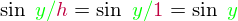

# 攝像機(Camera)

原文     | [Camera](http://learnopengl.com/#!Getting-started/Camera)
      ---|---
作者     | JoeyDeVries
翻譯     | [Django](http://bullteacher.com/)
校對     | Geequlim

前面的教程中我們討論了觀察矩陣以及如何使用觀察矩陣移動場景。OpenGL本身沒有攝像機的概念，但我們可以通過把場景中的所有物體往相反方向移動的方式來模擬出攝像機，這樣感覺就像我們在移動，而不是場景在移動。

本節我們將會討論如何在OpenGL中模擬一個攝像機，將會討論FPS風格的可自由在3D場景中移動的攝像機。我們也會討論鍵盤和鼠標輸入，最終完成一個自定義的攝像機類。

### 攝像機/觀察空間(Camera/View Space)

當我們討論攝像機/觀察空間的時候，是我們在討論以攝像機的透視圖作為場景原點時場景中所有可見頂點座標。觀察矩陣把所有的世界座標變換到觀察座標，這些新座標是相對於攝像機的位置和方向的。定義一個攝像機，我們需要一個攝像機在世界空間中的位置、觀察的方向、一個指向它的右測的向量以及一個指向它上方的向量。細心的讀者可能已經注意到我們實際上創建了一個三個單位軸相互垂直的、以攝像機的位置為原點的座標系。


#### 1.攝像機位置

獲取攝像機位置很簡單。攝像機位置簡單來說就是世界空間中代表攝像機位置的向量。我們把攝像機位置設置為前面教程中的那個相同的位置：

```c++
glm::vec3 cameraPos = glm::vec3(0.0f, 0.0f, 3.0f);
```

!!! Important

	不要忘記正z軸是從屏幕指向你的，如果我們希望攝像機向後移動，我們就往z軸正方向移動。

#### 2.攝像機方向

下一個需要的向量是攝像機的方向，比如它指向哪個方向。現在我們讓攝像機指向場景原點：(0, 0, 0)。用攝像機位置向量減去場景原點向量的結果就是攝像機指向向量。由於我們知道攝像機指向z軸負方向，我們希望方向向量指向攝像機的z軸正方向。如果我們改變相減的順序，我們就會獲得一個指向攝像機正z軸方向的向量(譯註：注意看前面的那個圖，所說的「方向向量/Direction Vector」是指向z的正方向的，而不是攝像機所注視的那個方向)：

```c++
glm::vec3 cameraTarget = glm::vec3(0.0f, 0.0f, 0.0f);
glm::vec3 cameraDirection = glm::normalize(cameraPos - cameraTarget);
```

!!! Attention

	方向向量(Direction Vector)並不是最好的名字，因為它正好指向從它到目標向量的相反方向。

#### 3.右軸(Right axis)

我們需要的另一個向量是一個**右向量(Right Vector)**，它代表攝像機空間的x軸的正方向。為獲取右向量我們需要先使用一個小技巧：定義一個**上向量(Up Vector)**。我們把上向量和第二步得到的攝像機方向向量進行叉乘。兩個向量叉乘的結果就是同時垂直於兩向量的向量，因此我們會得到指向x軸正方向的那個向量(如果我們交換兩個向量的順序就會得到相反的指向x軸負方向的向量)：

```c++
glm::vec3 up = glm::vec3(0.0f, 1.0f, 0.0f); 
glm::vec3 cameraRight = glm::normalize(glm::cross(up, cameraDirection));
```

#### 4.上軸(Up axis)

現在我們已經有了x軸向量和z軸向量，獲取攝像機的正y軸相對簡單；我們把右向量和方向向量(Direction Vector)進行叉乘：

```c++
glm::vec3 cameraUp = glm::cross(cameraDirection, cameraRight);
```

在叉乘和一些小技巧的幫助下，我們創建了所有觀察/攝像機空間的向量。對於想學到更多數學原理的讀者，提示一下，在線性代數中這個處理叫做[Gram-Schmidt(葛蘭—施密特)正交](http://en.wikipedia.org/wiki/Gram%E2%80%93Schmidt_process)。使用這些攝像機向量我們就可以創建一個**LookAt**矩陣了，它在創建攝像機的時候非常有用。

### Look At

使用矩陣的好處之一是如果你定義了一個座標空間，裡面有3個相互垂直的軸，你可以用這三個軸外加一個平移向量來創建一個矩陣，你可以用這個矩陣乘以任何向量來變換到那個座標空間。這正是LookAt矩陣所做的，現在我們有了3個相互垂直的軸和一個定義攝像機空間的位置座標，我們可以創建我們自己的LookAt矩陣了：


是右向量，是上向量，是方向向量是攝像機位置向量。注意，位置向量是相反的，因為我們最終希望把世界平移到與我們自身移動的相反方向。使用這個LookAt矩陣座標觀察矩陣可以很高效地把所有世界座標變換為觀察座標LookAt矩陣就像它的名字表達的那樣：它會創建一個觀察矩陣looks at(看著)一個給定目標。

幸運的是，GLM已經提供了這些支持。我們要做的只是定義一個攝像機位置，一個目標位置和一個表示上向量的世界空間中的向量(我們使用上向量計算右向量)。接著GLM就會創建一個LookAt矩陣，我們可以把它當作我們的觀察矩陣：

```c++
glm::mat4 view;
view = glm::lookAt(glm::vec3(0.0f, 0.0f, 3.0f), 
  		   glm::vec3(0.0f, 0.0f, 0.0f), 
  		   glm::vec3(0.0f, 1.0f, 0.0f));
```

`glm::LookAt`函數需要一個位置、目標和上向量。它可以創建一個和前面所說的同樣的觀察矩陣。

在開始做用戶輸入之前，我們來做些有意思的事，把我們的攝像機在場景中旋轉。我們的注視點保持在(0, 0, 0)。

我們在每一幀都創建x和z座標，這要使用一點三角學知識。x和z表示一個在一個圓圈上的一點，我們會使用它作為攝像機的位置。通過重複計算x和y座標，遍歷所有圓圈上的點，這樣攝像機就會繞著場景旋轉了。我們預先定義這個圓圈的半徑，使用`glfwGetTime`函數不斷增加它的值，在每次渲染迭代創建一個新的觀察矩陣。

```c++
GLfloat radius = 10.0f;
GLfloat camX = sin(glfwGetTime()) * radius;
GLfloat camZ = cos(glfwGetTime()) * radius;
glm::mat4 view;
view = glm::lookAt(glm::vec3(camX, 0.0, camZ), glm::vec3(0.0, 0.0, 0.0), glm::vec3(0.0, 1.0, 0.0));  
```

如果你運行代碼你會得到下面的東西：

<video src="http://learnopengl.com/video/getting-started/camera_circle.mp4" controls="controls">
</video>

這一小段代碼中，攝像機圍繞場景轉動。自己試試改變半徑和位置/方向參數，看看LookAt矩陣是如何工作的。同時，這裡有[源碼](http://learnopengl.com/code_viewer.php?code=getting-started/camera_circle)、[頂點](http://learnopengl.com/code_viewer.php?code=getting-started/coordinate_systems&type=vertex)和[片段](http://learnopengl.com/code_viewer.php?code=getting-started/coordinate_systems&type=fragment)著色器。

## 自由移動

讓攝像機繞著場景轉很有趣，但是讓我們自己移動攝像機更有趣！首先我們必須設置一個攝像機系統，在我們的程序前面定義一些攝像機變量很有用：

```c++
glm::vec3 cameraPos   = glm::vec3(0.0f, 0.0f,  3.0f);
glm::vec3 cameraFront = glm::vec3(0.0f, 0.0f, -1.0f);
glm::vec3 cameraUp    = glm::vec3(0.0f, 1.0f,  0.0f);
```

LookAt函數現在成了：

```c++
view = glm::lookAt(cameraPos, cameraPos + cameraFront, cameraUp);
```

我們首先設置之前定義的`cameraPos`為攝像機位置。方向(Direction)是當前的位置加上我們剛剛定義的方向向量。這樣能保證無論我們怎麼移動，攝像機都會注視目標。我們在按下某個按鈕時更新`cameraPos`向量。

我們已經為GLFW的鍵盤輸入定義了一個`key_callback`函數，我們來添加幾個新按鍵命令：

```c++
void key_callback(GLFWwindow* window, int key, int scancode, int action, int mode)
{
    ...
    GLfloat cameraSpeed = 0.05f;
    if(key == GLFW_KEY_W)
        cameraPos += cameraSpeed * cameraFront;
    if(key == GLFW_KEY_S)
        cameraPos -= cameraSpeed * cameraFront;
    if(key == GLFW_KEY_A)
        cameraPos -= glm::normalize(glm::cross(cameraFront, cameraUp)) * cameraSpeed;
    if(key == GLFW_KEY_D)
        cameraPos += glm::normalize(glm::cross(cameraFront, cameraUp)) * cameraSpeed;  
}
```

當我們按下WASD鍵，攝像機的位置都會相應更新。如果我們希望向前或向後移動，我們就把位置向量加上或減去方向向量。如果我們希望向旁邊移動，我們做一個叉乘來創建一個右向量，沿著它移動就可以了。這樣就創建了類似使用攝像機橫向、前後移動的效果。

!!! Important

	注意，我們對右向量進行了標準化。如果我們沒對這個向量進行標準化，最後的叉乘結果會根據`cameraFront`變量的大小返回不同的大小。如果我們不對向量進行標準化，我們就得根據攝像機的方位加速或減速移動了，但假如進行了標準化移動就是勻速的。

如果你用這段代碼更新`key_callback`函數，你就可以在場景中自由的前後左右移動了。

<video src="http://learnopengl.com/video/getting-started/camera_inside.mp4" controls="controls">
</video>

你可能會注意到這個攝像機系統不能同時朝兩個方向移動，當你按下一個按鍵時，它會先頓一下才開始移動。這是因為大多數事件輸入系統一次只能處理一個鍵盤輸入，它們的函數只有當我們激活了一個按鍵時才被調用。大多數GUI系統都是這樣的，它對攝像機來說用並不合理。我們可以用一些小技巧解決這個問題。

這個技巧是隻在回調函數中跟蹤哪個鍵被按下/釋放。在遊戲循環中我們讀取這些值，檢查那個按鍵被激活了，然後做出相應反應。我們只儲存哪個鍵被按下/釋放的狀態信息，在遊戲循環中對狀態做出反應，我們來創建一個布爾數組代表按下/釋放的鍵：

```c++
bool keys[1024];
```

然後我們必須在`key_callback`函數中設置按下/釋放鍵為`true`或`false`：

```c++
if(action == GLFW_PRESS)
    keys[key] = true;
else if(action == GLFW_RELEASE)
    keys[key] = false;
```

我們創建一個新的叫做`do_movement`的函數，用它根據按下的按鍵來更新攝像機的值：

```c++
void do_movement()
{
  // 攝像機控制
  GLfloat cameraSpeed = 0.01f;
  if(keys[GLFW_KEY_W])
  	cameraPos += cameraSpeed * cameraFront;
  if(keys[GLFW_KEY_S])
  	cameraPos -= cameraSpeed * cameraFront;
  if(keys[GLFW_KEY_A])
  	cameraPos -= glm::normalize(glm::cross(cameraFront, cameraUp)) * cameraSpeed;
  if(keys[GLFW_KEY_D])
  	cameraPos += glm::normalize(glm::cross(cameraFront, cameraUp)) * cameraSpeed;
}
```

之前的代碼移動到了`do_movement`函數中。由於所有GLFW的按鍵枚舉都是整數，我們可以把它們當數組索引使用。

最後，我們需要在遊戲循環中添加新函數的調用：

```c++
while(!glfwWindowShouldClose(window))
{
  // 檢測並調用事件
  glfwPollEvents();
  do_movement();  
  
  // 渲染
  ...
}
```

至此，你可以同時向多個方向移動了，並且當你按下按鈕也會立刻運動了。如遇困難查看[源碼](http://learnopengl.com/code_viewer.php?code=getting-started/camera_keyboard)。

### 移動速度

目前我們的移動速度是個常量。看起來不錯，但是實際情況下根據處理器的能力不同，有的人在同一段時間內會比其他人繪製更多幀。也就是調用了更多次`do_movement`函數。每個人的運動速度就都不同了。當你要發佈的你應用的時候，你必須確保在所有硬件上移動速度都一樣。

圖形和遊戲應用通常有回跟蹤一個`deltaTime`變量，它儲存渲染上一幀所用的時間。我們把所有速度都去乘以`deltaTime`值。當我們的`deltaTime`變大時意味著上一幀渲染花了更多時間，所以這一幀使用這個更大的`deltaTime`的值乘以速度，會獲得更高的速度，這樣就與上一幀平衡了。使用這種方法時，無論你的機器快還是慢，攝像機的速度都會保持一致，這樣每個用戶的體驗就都一樣了。

我們要用兩個全局變量來計算出`deltaTime`值：

```c++
GLfloat deltaTime = 0.0f;	// 當前幀遇上一幀的時間差
GLfloat lastFrame = 0.0f;  	// 上一幀的時間
```

在每一幀中我們計算出新的`deltaTime`以備後用

```c++
GLfloat currentFrame = glfwGetTime();
deltaTime = currentFrame - lastFrame;
lastFrame = currentFrame;  
```

現在我們有了`deltaTime`在計算速度的使用可以使用了：

```c++
void Do_Movement()
{
  GLfloat cameraSpeed = 5.0f * deltaTime;
  ...
}
```

與前面的部分結合在一起，我們有了一個更流暢點的攝像機系統：


<video src="http://learnopengl.com/video/getting-started/camera_smooth.mp4" controls="controls">
</video>

現在我們有了一個在任何系統上移動速度都一樣的攝像機。這裡是源碼。我們可以看到任何移動都會影響返回的`deltaTime`值。


## 自由觀看

只用鍵盤移動沒什麼意思。特別是我們還不能轉向。是時候使用鼠標了！

為了能夠改變方向，我們必須根據鼠標的輸入改變`cameraFront`向量。然而，根據鼠標旋轉改變方向向量有點複雜，需要更多的三角學知識。如果你對三角學知之甚少，別擔心，你可以跳過這一部分，直接複製粘貼我們的代碼；當你想了解更多的時候再回來看。

### 歐拉角

歐拉角是表示3D空間中可以表示任何旋轉的三個值，由萊昂哈德·歐拉在18世紀提出。有三種歐拉角：俯仰角(Pitch)、偏航角(Yaw)和滾轉角(Roll)，下面的圖片展示了它們的含義：


**俯仰角**是描述我們如何往上和往下看的角，它在第一張圖中表示。第二張圖顯示了**偏航角**，偏航角表示我們往左和往右看的大小。**滾轉角**代表我們如何翻滾攝像機。每個歐拉角都有一個值來表示，把三個角結合起來我們就能夠計算3D空間中任何的旋轉了。

對於我們的攝像機系統來說，我們只關心俯仰角和偏航角，所以我們不會討論滾轉角。用一個給定的俯仰角和偏航角，我們可以把它們轉換為一個代表新的方向向量的3D向量。俯仰角和偏航角轉換為方向向量的處理需要一些三角學知識，我們以最基本的情況開始：


如果我們把斜邊邊長定義為1，我們就能知道鄰邊的長度是，它的對邊是。這樣我們獲得了能夠得到x和y方向的長度的公式，它們取決於所給的角度。我們使用它來計算方向向量的元素：


這個三角形看起來和前面的三角形很像，所以如果我們想象自己在xz平面上，正望向y軸，我們可以基於第一個三角形計算長度/y方向的強度(我們往上或往下看多少)。從圖中我們可以看到一個給定俯仰角的y值等於sinθ:

```c++
direction.y = sin(glm::radians(pitch)); // 注意我們先把角度轉為弧度
```

這裡我們只更新了y值，仔細觀察x和z元素也被影響了。從三角形中我們可以看到它們的值等於：

```c++
direction.x = cos(glm::radians(pitch));
direction.z = cos(glm::radians(pitch));
```

看看我們是否能夠為偏航角找到需要的元素：


就像俯仰角一樣我們可以看到x元素取決於cos(偏航角)的值，z值同樣取決於偏航角的正弦值。把這個加到前面的值中，會得到基於俯仰角和偏航角的方向向量：

!!! Important

    譯註:這裡的球座標與笛卡爾座標的轉換把x和z弄反了，如果你去看最後的源碼，會發現作者在攝像機源碼那裡寫了`yaw = yaw – 90`，實際上在這裡x就應該是`sin(glm::radians(yaw))`，z也是同樣處理，當然也可以認為是這個詭異的座標系，但是在這裡使用球座標轉笛卡爾座標有個大問題，就是在初始渲染時，無法指定攝像機的初始朝向，還要花一些功夫自己實現這個；此外這隻能實現像第一人稱遊戲一樣的簡易攝像機，類似Maya、Unity3D編輯器窗口的那種攝像機還是最好自己設置攝像機的位置、上、右、前軸，在旋轉時用四元數對這四個變量進行調整，才能獲得更好的效果，而不是僅僅調整攝像機前軸。

```c++
direction.x = cos(glm::radians(pitch)) * cos(glm::radians(yaw));//譯註：direction代表攝像機的“前”軸，但此前軸是和本文第一幅圖片的第二個攝像機的direction是相反的
direction.y = sin(glm::radians(pitch));
direction.z = cos(glm::radians(pitch)) * sin(glm::radians(yaw));
```

這樣我們就有了一個可以把俯仰角和偏航角轉化為用來自由旋轉的攝像機的3個維度的方向向量了。你可能會奇怪：我們怎麼得到俯仰角和偏航角？

### 鼠標輸入

偏航角和俯仰角是從鼠標移動獲得的，鼠標水平移動影響偏航角，鼠標垂直移動影響俯仰角。它的思想是儲存上一幀鼠標的位置，在當前幀中我們當前計算鼠標位置和上一幀的位置相差多少。如果差別越大那麼俯仰角或偏航角就改變越大。

首先我們要告訴GLFW，應該隱藏光標，並**捕捉(Capture)**它。捕捉鼠標意味著當應用集中焦點到鼠標上的時候光標就應該留在窗口中(除非應用拾取焦點或退出)。我們可以進行簡單的配置:


```c++
glfwSetInputMode(window, GLFW_CURSOR, GLFW_CURSOR_DISABLED);
```

這個函數調用後，無論我們怎麼去移動鼠標，它都不會顯示了，也不會離開窗口。對於FPS攝像機系統來說很好：

為計算俯仰角和偏航角我們需要告訴GLFW監聽鼠標移動事件。我們用下面的原型創建一個回調函數來做這件事(和鍵盤輸入差不多)：

```c++
void mouse_callback(GLFWwindow* window, double xpos, double ypos);
```

這裡的`xpos`和`ypos`代表當前鼠標的位置。我們註冊了GLFW的回調函數，鼠標一移動`mouse_callback`函數就被調用：

```c++
glfwSetCursorPosCallback(window, mouse_callback);
```

在處理FPS風格的攝像機鼠標輸入的時候，我們必須在獲取最終的方向向量之前做下面這幾步：

1. 計算鼠標和上一幀的偏移量。
2. 把偏移量添加到攝像機和俯仰角和偏航角中。
3. 對偏航角和俯仰角進行最大和最小值的限制。
4. 計算方向向量。

第一步計算鼠標自上一幀的偏移量。我們必須先儲存上一幀的鼠標位置，我們把它的初始值設置為屏幕的中心(屏幕的尺寸是800乘600)：

```c++
GLfloat lastX = 400, lastY = 300;
```

然後在回調函數中我們計算當前幀和上一幀鼠標位置的偏移量：

```c++
GLfloat xoffset = xpos - lastX;
GLfloat yoffset = lastY - ypos; // 注意這裡是相反的，因為y座標的範圍是從下往上的
lastX = xpos;
lastY = ypos;

GLfloat sensitivity = 0.05f;
xoffset *= sensitivity;
yoffset *= sensitivity;
```

注意我們把偏移量乘以了`sensitivity`值。如果我們移除它，鼠標移動就會太大了；你可以自己調整`sensitivity`的值。

下面我們把偏移量加到全局變量`pitch`和`yaw`上：

```c++
yaw   += xoffset;
pitch += yoffset;  
```

第三步我們給攝像機添加一些限制，這樣攝像機就不會發生奇怪的移動了。對於俯仰角，要讓用戶不能看向高於89度(90度時視角會逆轉，所以我們把89度作為極限)的地方，同樣也不允許小於-89度。這樣能夠保證用戶只能看到天空或腳下但是不能更進一步超越過去。限制可以這樣做：

```c++
if(pitch > 89.0f)
  pitch =  89.0f;
if(pitch < -89.0f)
  pitch = -89.0f;
```

注意我們沒有給偏航角設置限制是因為我們不希望限制用戶的水平旋轉。然而，給偏航角設置限制也很容易，只要你願意。

第四也是最後一步是使用俯仰角和偏航角來的到前面提到的實際方向向量：

```c++
glm::vec3 front;
front.x = cos(glm::radians(pitch)) * cos(glm::radians(yaw));
front.y = sin(glm::radians(pitch));
front.z = cos(glm::radians(pitch)) * sin(glm::radians(yaw));
cameraFront = glm::normalize(front);
```

這回計算出方向向量，根據鼠標點的移動它包含所有的旋轉。由於`cameraFront`向量已經包含在`glm::lookAt`函數中，我們直接去設置。

如果你現在運行代碼，你會發現當程序運行第一次捕捉到鼠標的時候攝像機會突然跳一下。原因是當你的鼠標進入窗口鼠標回調函數會使用這時的`xpos`和`ypos`。這通常是一個距離屏幕中心很遠的地方，因而產生一個很大的偏移量，所以就會跳了。我們可以簡單的使用一個布爾變量檢驗我們是否是第一次獲取鼠標輸入，如果是，那麼我們先把鼠標的位置更新為`xpos`和`ypos`，這樣就能解決這個問題；最後的鼠標移動會使用進入以後鼠標的位置座標來計算它的偏移量：

```c++
if(firstMouse) // 這個bool變量一開始是設定為true的
{
  lastX = xpos;
  lastY = ypos;
  firstMouse = false;
}
```

最後的代碼應該是這樣的：

```c++
void mouse_callback(GLFWwindow* window, double xpos, double ypos)
{
    if(firstMouse)
    {
        lastX = xpos;
        lastY = ypos;
        firstMouse = false;
    }
  
    GLfloat xoffset = xpos - lastX;
    GLfloat yoffset = lastY - ypos; 
    lastX = xpos;
    lastY = ypos;

    GLfloat sensitivity = 0.05;
    xoffset *= sensitivity;
    yoffset *= sensitivity;

    yaw   += xoffset;
    pitch += yoffset;

    if(pitch > 89.0f)
        pitch = 89.0f;
    if(pitch < -89.0f)
        pitch = -89.0f;

    glm::vec3 front;
    front.x = cos(glm::radians(yaw)) * cos(glm::radians(pitch));
    front.y = sin(glm::radians(pitch));
    front.z = sin(glm::radians(yaw)) * cos(glm::radians(pitch));
    cameraFront = glm::normalize(front);
}  
```

現在我們可以自由的在3D場景中移動了！如果你遇到困難，[這是](http://www.learnopengl.com/code_viewer.php?code=getting-started/camera_mouse)源碼。

### 縮放

我們還要往攝像機系統里加點東西，實現一個縮放接口。前面教程中我們說視野(Field of View或fov)定義了我們可以看到場景中多大的範圍。當視野變小時可視區域就會減小，產生放大了的感覺。我們用鼠標滾輪來放大。和鼠標移動、鍵盤輸入一樣我們需要一個鼠標滾輪的回調函數：

```c++
void scroll_callback(GLFWwindow* window, double xoffset, double yoffset)
{
  if(aspect >= 1.0f && aspect <= 45.0f)
  	aspect -= yoffset;
  if(aspect <= 1.0f)
  	aspect = 1.0f;
  if(aspect >= 45.0f)
  	aspect = 45.0f;
}
```

`yoffset`值代表我們滾動的大小。當`scroll_callback`函數調用後，我們改變全局`aspect`變量的內容。因為`45.0f`是默認的`fov`，我們將會把縮放級別限制在`1.0f`到`45.0f`。

我們現在在每一幀都必須把透視投影矩陣上傳到GPU，但這一次使`aspect`變量作為它的fov：

```c++
projection = glm::perspective(aspect, (GLfloat)WIDTH/(GLfloat)HEIGHT, 0.1f, 100.0f);
```

最後不要忘記註冊滾動回調函數：

```c++
glfwSetScrollCallback(window, scroll_callback);
```

現在我們實現了一個簡單的攝像機系統，它能夠讓我們在3D環境中自由移動。

<video src="http://learnopengl.com/video/getting-started/camera_mouse.mp4" controls="controls">
</video>

自由的去實驗，如果遇到困難對比[源代碼](http://learnopengl.com/code_viewer.php?code=getting-started/camera_zoom)。

!!! Important

	注意，使用歐拉角作為攝像機系統並不完美。你仍然可能遇到[萬向節死鎖](http://en.wikipedia.org/wiki/Gimbal_lock)。最好的攝像機系統是使用四元數的，後面會有討論。

## 攝像機類

接下來的教程我們會使用一個攝像機來瀏覽場景，從各個角度觀察結果。然而由於一個攝像機會佔教程的很大的篇幅，我們會從細節抽象出創建一個自己的攝像機對象。與著色器教程不同我們不會帶你一步一步創建攝像機類，如果你想知道怎麼工作的的話，只會給你提供一個(有完整註釋的)源碼。

像著色器對象一樣，我們把攝像機類寫在一個單獨的頭文件中。你可以在[這裡](http://learnopengl.com/code_viewer.php?type=header&code=camera)找到它。你應該能夠理解所有的代碼。我們建議您至少看一看這個類，看看如何創建一個自己的攝像機類。

!!! Attention

	我們介紹的歐拉角FPS風格攝像機系統能夠滿足大多數情況需要，但是在創建不同的攝像機系統，比如飛行模擬就要當心。每個攝像機系統都有自己的有點和不足，所以確保對它們進行了詳細研究。比如，這個FPS射線機不允許俯仰角大於90多，由於使用了固定的上向量(0, 1, 0)，我們就不能用滾轉角。

使用新的攝像機對象的更新後的版本源碼可以[在這裡找到](http://learnopengl.com/code_viewer.php?code=getting-started/camera_with_class)。(譯註：總而言之這個攝像機實現並不十分完美，你可以看看最終的源碼。建議先看[這篇文章](https://github.com/cybercser/OpenGL_3_3_Tutorial_Translation/blob/master/Tutorial%2017%20Rotations.md)，對旋轉有更深的理解後，你就能做出更好的攝像機類，不過本文有些內容比如如何防止按鍵停頓和glfw鼠標事件實現攝像機的注意事項比較重要，其它的就要做一定的取捨了)


## 練習

- 看看你是否能夠變換攝像機類從而使得其能夠變- 成一個**真正的**FPS攝像機(也就是說不能夠隨意飛行)；你只能夠呆在xz平面上: [參考解答](http://www.learnopengl.com/code_viewer.php?code=getting-started/camera-exercise1)

- 試著創建你自己的LookAt函數，使你能夠手動創建一個我們在一開始討論的觀察矩陣。用你的函數實現來替換glm的LookAt函數，看看它是否還能一樣的工作：[參考解答](http://www.learnopengl.com/code_viewer.php?code=getting-started/camera-exercise2)