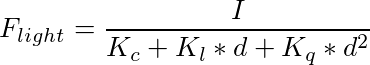
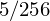
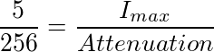
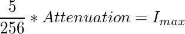
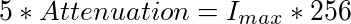
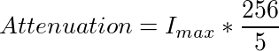
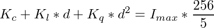
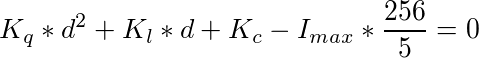
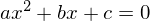
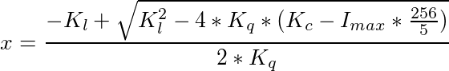

# 延遲著色法(Deferred Shading)

原文     | [Deferred Shading](http://learnopengl.com/#!Advanced-Lighting/Deferred-Shading)
      ---|---
作者     | JoeyDeVries
翻譯     | Meow J
校對     | 未校對

我們現在一直使用的光照方式叫做**正向渲染(Forward Rendering)**或者**正向著色法(Forward Shading)**，它是我們渲染物體的一種非常直接的方式，在場景中我們根據所有光源照亮一個物體，之後再渲染下一個物體，以此類推。它非常容易理解，也很容易實現，但是同時它對程序性能的影響也很大，因為對於每一個需要渲染的物體，程序都要對每一個光源每一個需要渲染的片段進行迭代，這是**非常**多的！因為大部分片段著色器的輸出都會被之後的輸出覆蓋，正向渲染還會在場景中因為高深的複雜度(多個物體重合在一個像素上)浪費大量的片段著色器運行時間。

**延遲著色法(Deferred Shading)**，**或者說是延遲渲染(Deferred Rendering)**，為了解決上述問題而誕生了，它大幅度地改變了我們渲染物體的方式。這給我們優化擁有大量光源的場景提供了很多的選擇，因為它能夠在渲染上百甚至上千光源的同時還能夠保持能讓人接受的幀率。下面這張圖片包含了一共1874個點光源，它是使用延遲著色法來完成的，而這對於正向渲染幾乎是不可能的(圖片來源：Hannes Nevalainen)。


延遲著色法基於我們**延遲(Defer)**或**推遲(Postpone)**大部分計算量非常大的渲染(像是光照)到後期進行處理的想法。它包含兩個處理階段(Pass)：在第一個幾何處理階段(Geometry Pass)中，我們先渲染場景一次，之後獲取對象的各種幾何信息，並儲存在一系列叫做G緩衝(G-buffer)的紋理中；想想位置向量(Position Vector)、顏色向量(Color Vector)、法向量(Normal Vector)和/或鏡面值(Specular Value)。場景中這些儲存在G緩衝中的幾何信息將會在之後用來做(更復雜的)光照計算。下面是一幀中G緩衝的內容：


我們會在第二個光照處理階段(Lighting Pass)中使用G緩衝內的紋理數據。在光照處理階段中，我們渲染一個屏幕大小的方形，並使用G緩衝中的幾何數據對每一個片段計算場景的光照；在每個像素中我們都會對G緩衝進行迭代。我們對於渲染過程進行解耦，將它高級的片段處理挪到後期進行，而不是直接將每個對象從頂點著色器帶到片段著色器。光照計算過程還是和我們以前一樣，但是現在我們需要從對應的G緩衝而不是頂點著色器(和一些uniform變量)那裡獲取輸入變量了。

下面這幅圖片很好地展示了延遲著色法的整個過程：


這種渲染方法一個很大的好處就是能保證在G緩衝中的片段和在屏幕上呈現的像素所包含的片段信息是一樣的，因為深度測試已經最終將這裡的片段信息作為最頂層的片段。這樣保證了對於在光照處理階段中處理的每一個像素都只處理一次，所以我們能夠省下很多無用的渲染調用。除此之外，延遲渲染還允許我們做更多的優化，從而渲染更多的光源。

在幾何處理階段中填充G緩衝非常高效，因為我們直接儲存像是位置，顏色或者是法線等對象信息到幀緩衝中，而這幾乎不會消耗處理時間。在此基礎上使用多渲染目標(Multiple Render Targets, MRT)技術，我們甚至可以在一個渲染處理之內完成這所有的工作。

## G緩衝

G緩衝(G-buffer)是對所有用來儲存光照相關的數據，並在最後的光照處理階段中使用的所有紋理的總稱。趁此機會，讓我們順便複習一下在正向渲染中照亮一個片段所需要的所有數據：

- 一個3D**位置**向量來計算(插值)片段位置變量供`lightDir`和`viewDir`使用
- 一個RGB漫反射**顏色**向量，也就是反照率(Albedo)
- 一個3D**法**向量來判斷平面的斜率
- 一個鏡面強度(Specular Intensity)浮點值
- 所有光源的位置和顏色向量
- 玩家或者觀察者的位置向量

有了對這些(每個片段獨立的)變量的處置權，我們就能夠計算我們很熟悉的(布林-)馮氏光照(Blinn-Phong Lighting)了。光源的位置，顏色，和玩家的觀察位置可以通過uniform變量來設置，但是其它變量對於每個對象的片段都是不同的。如果我們能以某種方式傳輸完全相同的數據到最終的延遲光照處理階段中，我們就能計算與之前相同的光照效果了，儘管我們只是在渲染一個2D方形的片段。

OpenGL並沒有限制我們能在紋理中能存儲的東西，所以現在你應該清楚在一個或多個屏幕大小的紋理中儲存所有(對於每個片段獨立的)數據並在之後光照處理階段中使用的可行性了。因為G緩衝紋理將會和光照處理階段中的2D方形一樣大，我們會獲得和正向渲染設置完全一樣的片段數據，但在光照處理階段這裡是一對一映射。

整個過程在偽代碼中會是這樣的：

```c++
while(...) // 遊戲循環
{
    // 1. 幾何處理階段：渲染所有的幾何/顏色數據到G緩衝 
    glBindFramebuffer(GL_FRAMEBUFFER, gBuffer);
    glClear(GL_COLOR_BUFFER_BIT | GL_DEPTH_BUFFER_BIT);
    gBufferShader.Use();
    for(Object obj : Objects)
    {
        ConfigureShaderTransformsAndUniforms();
        obj.Draw();
    }  
    // 2. 光照處理階段：使用G緩衝計算場景的光照
    glBindFramebuffer(GL_FRAMEBUFFER, 0);
    glClear(GL_COLOR_BUFFER_BIT);
    lightingPassShader.Use();
    BindAllGBufferTextures();
    SetLightingUniforms();
    RenderQuad();
}
```

對於每一個片段我們需要儲存的數據有：一個**位置**向量、一個**法**向量，一個**顏色**向量，一個鏡面強度值。所以我們在幾何處理階段中需要渲染場景中所有的對象並儲存這些數據分量到G緩衝中。我們可以再次使用**多渲染目標(Multiple Render Targets)**來在一個渲染處理之內渲染多個顏色緩衝，在之前的[泛光教程](http://learnopengl-cn.readthedocs.org/zh/latest/05%20Advanced%20Lighting/07%20Bloom/)中我們也簡單地提及了它。

對於幾何渲染處理階段，我們首先需要初始化一個幀緩衝對象，我們很直觀的稱它為`gBuffer`，它包含了多個顏色緩衝和一個單獨的深度渲染緩衝對象(Depth Renderbuffer Object)。對於位置和法向量的紋理，我們希望使用高精度的紋理(每分量16或32位的浮點數)，而對於反照率和鏡面值，使用默認的紋理(每分量8位浮點數)就夠了。

```c++
GLuint gBuffer;
glGenFramebuffers(1, &gBuffer);
glBindFramebuffer(GL_FRAMEBUFFER, gBuffer);
GLuint gPosition, gNormal, gColorSpec;
  
// - 位置顏色緩衝
glGenTextures(1, &gPosition);
glBindTexture(GL_TEXTURE_2D, gPosition);
glTexImage2D(GL_TEXTURE_2D, 0, GL_RGB16F, SCR_WIDTH, SCR_HEIGHT, 0, GL_RGB, GL_FLOAT, NULL);
glTexParameteri(GL_TEXTURE_2D, GL_TEXTURE_MIN_FILTER, GL_NEAREST);
glTexParameteri(GL_TEXTURE_2D, GL_TEXTURE_MAG_FILTER, GL_NEAREST);
glFramebufferTexture2D(GL_FRAMEBUFFER, GL_COLOR_ATTACHMENT0, GL_TEXTURE_2D, gPosition, 0
  
// - 法線顏色緩衝
glGenTextures(1, &gNormal);
glBindTexture(GL_TEXTURE_2D, gNormal);
glTexImage2D(GL_TEXTURE_2D, 0, GL_RGB16F, SCR_WIDTH, SCR_HEIGHT, 0, GL_RGB, GL_FLOAT, NULL);
glTexParameteri(GL_TEXTURE_2D, GL_TEXTURE_MIN_FILTER, GL_NEAREST);
glTexParameteri(GL_TEXTURE_2D, GL_TEXTURE_MAG_FILTER, GL_NEAREST);
glFramebufferTexture2D(GL_FRAMEBUFFER, GL_COLOR_ATTACHMENT1, GL_TEXTURE_2D, gNormal, 0);
  
// - 顏色 + 鏡面顏色緩衝
glGenTextures(1, &gAlbedoSpec);
glBindTexture(GL_TEXTURE_2D, gAlbedoSpec);
glTexImage2D(GL_TEXTURE_2D, 0, GL_RGBA, SCR_WIDTH, SCR_HEIGHT, 0, GL_RGBA, GL_FLOAT, NULL);
glTexParameteri(GL_TEXTURE_2D, GL_TEXTURE_MIN_FILTER, GL_NEAREST);
glTexParameteri(GL_TEXTURE_2D, GL_TEXTURE_MAG_FILTER, GL_NEAREST);
glFramebufferTexture2D(GL_FRAMEBUFFER, GL_COLOR_ATTACHMENT2, GL_TEXTURE_2D, gAlbedoSpec, 0);
  
// - 告訴OpenGL我們將要使用(幀緩衝的)哪種顏色附件來進行渲染
GLuint attachments[3] = { GL_COLOR_ATTACHMENT0, GL_COLOR_ATTACHMENT1, GL_COLOR_ATTACHMENT2 };
glDrawBuffers(3, attachments);
  
// 之後同樣添加渲染緩衝對象(Render Buffer Object)為深度緩衝(Depth Buffer)，並檢查完整性
[...]
```

由於我們使用了多渲染目標，我們需要顯式告訴OpenGL我們需要使用`glDrawBuffers`渲染的是和`GBuffer`關聯的哪個顏色緩衝。同樣需要注意的是，我們使用RGB紋理來儲存位置和法線的數據，因為每個對象只有三個分量；但是我們將顏色和鏡面強度數據合併到一起，存儲到一個單獨的RGBA紋理裡面，這樣我們就不需要聲明一個額外的顏色緩衝紋理了。隨著你的延遲渲染管線變得越來越複雜，需要更多的數據的時候，你就會很快發現新的方式來組合數據到一個單獨的紋理當中。

接下來我們需要渲染它們到G緩衝中。假設每個對象都有漫反射，一個法線和一個鏡面強度紋理，我們會想使用一些像下面這個片段著色器的東西來渲染它們到G緩衝中去。

```c++
#version 330 core
layout (location = 0) out vec3 gPosition;
layout (location = 1) out vec3 gNormal;
layout (location = 2) out vec4 gAlbedoSpec;

in vec2 TexCoords;
in vec3 FragPos;
in vec3 Normal;

uniform sampler2D texture_diffuse1;
uniform sampler2D texture_specular1;

void main()
{    
    // 存儲第一個G緩衝紋理中的片段位置向量
    gPosition = FragPos;
    // 同樣存儲對每個片段獨立的法線到G緩衝中
    gNormal = normalize(Normal);
    // 和漫反射對每個片段獨立的顏色
    gAlbedoSpec.rgb = texture(texture_diffuse1, TexCoords).rgb;
    // 存儲鏡面強度到gAlbedoSpec的alpha分量
    gAlbedoSpec.a = texture(texture_specular1, TexCoords).r;
}  
```

因為我們使用了多渲染目標，這個佈局指示符(Layout Specifier)告訴了OpenGL我們需要渲染到當前的活躍幀緩衝中的哪一個顏色緩衝。注意我們並沒有儲存鏡面強度到一個單獨的顏色緩衝紋理中，因為我們可以儲存它單獨的浮點值到其它顏色緩衝紋理的alpha分量中。

!!! Attention

	請記住，因為有光照計算，所以保證所有變量在一個座標空間當中至關重要。在這裡我們在世界空間中存儲(並計算)所有的變量。

如果我們現在想要渲染一大堆納米裝戰士對象到`gBuffer`幀緩衝中，並通過一個一個分別投影它的顏色緩衝到填充屏幕的四邊形中嘗試將他們顯示出來，我們會看到向下面這樣的東西：


嘗試想象世界空間位置和法向量都是正確的。比如說，指向右側的法向量將會被更多地對齊到紅色上，從場景原點指向右側的位置矢量也同樣是這樣。一旦你對G緩衝中的內容滿意了，我們就該進入到下一步：光照處理階段了。

## 延遲光照處理階段

現在我們已經有了一大堆的片段數據儲存在G緩衝中供我們處置，我們可以選擇通過一個像素一個像素地遍歷各個G緩衝紋理，並將儲存在它們裡面的內容作為光照算法的輸入，來完全計算場景最終的光照顏色。由於所有的G緩衝紋理都代表的是最終變換的片段值，我們只需要對每一個像素執行一次昂貴的光照運算就行了。這使得延遲光照非常高效，特別是在需要調用大量重型片段著色器的複雜場景中。

對於這個光照處理階段，我們將會渲染一個2D全屏的方形(有一點像後期處理效果)並且在每個像素上運行一個昂貴的光照片段著色器。

```c++
glClear(GL_COLOR_BUFFER_BIT | GL_DEPTH_BUFFER_BIT);
shaderLightingPass.Use();
glActiveTexture(GL_TEXTURE0);
glBindTexture(GL_TEXTURE_2D, gPosition);
glActiveTexture(GL_TEXTURE1);
glBindTexture(GL_TEXTURE_2D, gNormal);
glActiveTexture(GL_TEXTURE2);
glBindTexture(GL_TEXTURE_2D, gAlbedoSpec);
// 同樣發送光照相關的uniform
SendAllLightUniformsToShader(shaderLightingPass);
glUniform3fv(glGetUniformLocation(shaderLightingPass.Program, "viewPos"), 1, &camera.Position[0]);
RenderQuad();  
```

我們在渲染之前綁定了G緩衝中所有相關的紋理，並且發送光照相關的uniform變量到著色器中。

光照處理階段的片段著色器和我們之前一直在用的光照教程著色器是非常相似的，除了我們添加了一個新的方法，從而使我們能夠獲取光照的輸入變量，當然這些變量我們會從G緩衝中直接採樣。

```c++
#version 330 core
out vec4 FragColor;
in vec2 TexCoords;

uniform sampler2D gPosition;
uniform sampler2D gNormal;
uniform sampler2D gAlbedoSpec;

struct Light {
    vec3 Position;
    vec3 Color;
};
const int NR_LIGHTS = 32;
uniform Light lights[NR_LIGHTS];
uniform vec3 viewPos;

void main()
{             
    // 從G緩衝中獲取數據
    vec3 FragPos = texture(gPosition, TexCoords).rgb;
    vec3 Normal = texture(gNormal, TexCoords).rgb;
    vec3 Albedo = texture(gAlbedoSpec, TexCoords).rgb;
    float Specular = texture(gAlbedoSpec, TexCoords).a;
    
    // 然後和往常一樣地計算光照
    vec3 lighting = Albedo * 0.1; // 硬編碼環境光照分量
    vec3 viewDir = normalize(viewPos - FragPos);
    for(int i = 0; i < NR_LIGHTS; ++i)
    {
        // 漫反射
        vec3 lightDir = normalize(lights[i].Position - FragPos);
        vec3 diffuse = max(dot(Normal, lightDir), 0.0) * Albedo * lights[i].Color;
        lighting += diffuse;
    }
    
    FragColor = vec4(lighting, 1.0);
}  
```

光照處理階段著色器接受三個uniform紋理，代表G緩衝，它們包含了我們在幾何處理階段儲存的所有數據。如果我們現在再使用當前片段的紋理座標採樣這些數據，我們將會獲得和之前完全一樣的片段值，這就像我們在直接渲染幾何體。在片段著色器的一開始，我們通過一個簡單的紋理查找從G緩衝紋理中獲取了光照相關的變量。注意我們從`gAlbedoSpec`紋理中同時獲取了`Albedo`顏色和`Spqcular`強度。

因為我們現在已經有了必要的(每個片段獨立的)變量(和相關的uniform變量)來計算布林-馮氏光照(Blinn-Phong Lighting)，我們不需要對光照代碼做任何修改了。我們在延遲著色法中唯一需要改的就是獲取光照輸入變量的方法。

運行一個包含32個小光源的簡單Demo會是像這樣子的：


你可以在以下位置找到Demo的完整[源代碼](http://learnopengl.com/code_viewer.php?code=advanced-lighting/deferred)，和幾何渲染階段的[頂點](http://learnopengl.com/code_viewer.php?code=advanced-lighting/deferred_geometry&type=vertex)和[片段](http://learnopengl.com/code_viewer.php?code=advanced-lighting/deferred_geometry&type=fragment)著色器，還有光照渲染階段的[頂點](http://learnopengl.com/code_viewer.php?code=advanced-lighting/deferred&type=vertex)和[片段](http://learnopengl.com/code_viewer.php?code=advanced-lighting/deferred&type=vertex)著色器。

延遲著色法的其中一個缺點就是它不能進行[混合](http://learnopengl-cn.readthedocs.org/zh/latest/04%20Advanced%20OpenGL/03%20Blending/)(Blending)，因為G緩衝中所有的數據都是從一個單獨的片段中來的，而混合需要對多個片段的組合進行操作。延遲著色法另外一個缺點就是它迫使你對大部分場景的光照使用相同的光照算法，你可以通過包含更多關於材質的數據到G緩衝中來減輕這一缺點。

為了克服這些缺點(特別是混合)，我們通常分割我們的渲染器為兩個部分：一個是延遲渲染的部分，另一個是專門為了混合或者其他不適合延遲渲染管線的著色器效果而設計的的正向渲染的部分。為了展示這是如何工作的，我們將會使用正向渲染器渲染光源為一個小立方體，因為光照立方體會需要一個特殊的著色器(會輸出一個光照顏色)。

## 結合延遲渲染與正向渲染

現在我們想要渲染每一個光源為一個3D立方體，並放置在光源的位置上隨著延遲渲染器一起發出光源的顏色。很明顯，我們需要做的第一件事就是在延遲渲染方形之上正向渲染所有的光源，它會在延遲渲染管線的最後進行。所以我們只需要像正常情況下渲染立方體，只是會在我們完成延遲渲染操作之後進行。代碼會像這樣：

```c++
// 延遲渲染光照渲染階段
[...]
RenderQuad();
  
// 現在像正常情況一樣正向渲染所有光立方體
shaderLightBox.Use();
glUniformMatrix4fv(locProjection, 1, GL_FALSE, glm::value_ptr(projection));
glUniformMatrix4fv(locView, 1, GL_FALSE, glm::value_ptr(view));
for (GLuint i = 0; i < lightPositions.size(); i++)
{
    model = glm::mat4();
    model = glm::translate(model, lightPositions[i]);
    model = glm::scale(model, glm::vec3(0.25f));
    glUniformMatrix4fv(locModel, 1, GL_FALSE, glm::value_ptr(model));
    glUniform3fv(locLightcolor, 1, &lightColors[i][0]);
    RenderCube();
}
```

然而，這些渲染出來的立方體並沒有考慮到我們儲存的延遲渲染器的幾何深度(Depth)信息，並且結果是它被渲染在之前渲染過的物體之上，這並不是我們想要的結果。


我們需要做的就是首先複製出在幾何渲染階段中儲存的深度信息，並輸出到默認的幀緩衝的深度緩衝，然後我們才渲染光立方體。這樣之後只有當它在之前渲染過的幾何體上方的時候，光立方體的片段才會被渲染出來。我們可以使用`glBlitFramebuffer`複製一個幀緩衝的內容到另一個幀緩衝中，這個函數我們也在[抗鋸齒](http://learnopengl-cn.readthedocs.org/zh/latest/04%20Advanced%20OpenGL/11%20Anti%20Aliasing/)的教程中使用過，用來還原多重採樣的幀緩衝。`glBlitFramebuffer`這個函數允許我們複製一個用戶定義的幀緩衝區域到另一個用戶定義的幀緩衝區域。

我們儲存所有延遲渲染階段中所有物體的深度信息在`gBuffer`這個FBO中。如果我們僅僅是簡單複製它的深度緩衝內容到默認幀緩衝的深度緩衝中，那麼光立方體就會像是場景中所有的幾何體都是正向渲染出來的一樣渲染出來。就像在抗鋸齒教程中介紹的那樣，我們需要指定一個幀緩衝為讀幀緩衝(Read Framebuffer)，並且類似地指定一個幀緩衝為寫幀緩衝(Write Framebuffer)：

```c++
glBindFramebuffer(GL_READ_FRAMEBUFFER, gBuffer);
glBindFramebuffer(GL_DRAW_FRAMEBUFFER, 0); // 寫入到默認幀緩衝
glBlitFramebuffer(
  0, 0, SCR_WIDTH, SCR_HEIGHT, 0, 0, SCR_WIDTH, SCR_HEIGHT, GL_DEPTH_BUFFER_BIT, GL_NEAREST
);
glBindFramebuffer(GL_FRAMEBUFFER, 0);
// 現在像之前一樣渲染光立方體
[...]  
```

在這裡我們複製整個讀幀緩衝的深度緩衝信息到默認幀緩衝的深度緩衝，對於顏色緩衝和模板緩衝我們也可以這樣處理。現在如果我們接下來再渲染光立方體，場景裡的幾何體將會看起來很真實了，而不只是簡單地粘貼立方體到2D方形之上：


你可以在[這裡](http://learnopengl.com/code_viewer.php?code=advanced-lighting/deferred_light_cube)找到Demo的源代碼，還有光立方體的[頂點](http://learnopengl.com/code_viewer.php?code=advanced-lighting/deferred_light_cube&type=vertex)和[片段](http://learnopengl.com/code_viewer.php?code=advanced-lighting/deferred_light_cube&type=fragment)著色器。

有了這種方法，我們就能夠輕易地結合延遲著色法和正向著色法了。這真是太棒了，我們現在可以應用混合或者渲染需要特殊著色器效果的物體了，這在延遲渲染中是不可能做到的。

## 更多的光源

延遲渲染一直被稱讚的原因就是它能夠渲染大量的光源而不消耗大量的性能。然而，延遲渲染它本身並不能支持非常大量的光源，因為我們仍然必須要對場景中每一個光源計算每一個片段的光照分量。真正讓大量光源成為可能的是我們能夠對延遲渲染管線引用的一個非常棒的優化：**光體積(Light Volumes)**

通常情況下，當我們渲染一個複雜光照場景下的片段著色器時，我們會計算場景中**每一個**光源的貢獻，不管它們離這個片段有多遠。很大一部分的光源根本就不會到達這個片段，所以為什麼我們還要浪費這麼多光照運算呢？

隱藏在光體積背後的想法就是計算光源的半徑，或是體積，也就是光能夠到達片段的範圍。由於大部分光源都使用了某種形式的衰減(Attenuation)，我們可以用它來計算光源能夠到達的最大路程，或者說是半徑。我們接下來只需要對那些在一個或多個光體積內的片段進行繁重的光照運算就行了。這可以給我們省下來很可觀的計算量，因為我們現在只在需要的情況下計算光照。

這個方法的難點基本就是找出一個光源光體積的大小，或者是半徑。

### 計算一個光源的體積或半徑

為了獲取一個光源的體積半徑，我們需要解一個對於一個我們認為是**黑暗(Dark)**的亮度(Brightness)的衰減方程，它可以是0.0，或者是更亮一點的但仍被認為黑暗的值，像是0.03。為了展示我們如何計算光源的體積半徑，我們將會使用一個在[投光物](http://learnopengl-cn.readthedocs.org/zh/latest/02%20Lighting/05%20Light%20casters/)這節中引入的一個更加複雜，但非常靈活的衰減方程：



我們現在想要在等於0的前提下解這個方程，也就是說光在該距離完全是黑暗的。然而這個方程永遠不會真正等於0.0，所以它沒有解。所以，我們不會求表達式等於0.0時候的解，相反我們會求當亮度值靠近於0.0的解，這時候它還是能被看做是黑暗的。在這個教程的演示場景中，我們選擇作為一個合適的光照值；除以256是因為默認的8-bit幀緩衝可以每個分量顯示這麼多強度值(Intensity)。

!!! Important

	我們使用的衰減方程在它的可視範圍內基本都是黑暗的，所以如果我們想要限制它為一個比更加黑暗的亮度，光體積就會變得太大從而變得低效。只要是用戶不能在光體積邊緣看到一個突兀的截斷，這個參數就沒事了。當然它還是依賴於場景的類型，一個高的亮度閥值會產生更小的光體積，從而獲得更高的效率，然而它同樣會產生一個很容易發現的副作用，那就是光會在光體積邊界看起來突然斷掉。

我們要求的衰減方程會是這樣：



在這裡，是光源最亮的顏色分量。我們之所以使用光源最亮的顏色分量是因為解光源最亮的強度值方程最好地反映了理想光體積半徑。

從這裡我們繼續解方程：











最後的方程形成了的形式，我們可以用求根公式來解這個二次方程：



它給我們了一個通用公式從而允許我們計算x的值，即光源的光體積半徑，只要我們提供了一個常量，線性和二次項參數：

```c++
GLfloat constant  = 1.0; 
GLfloat linear    = 0.7;
GLfloat quadratic = 1.8;
GLfloat lightMax  = std::fmaxf(std::fmaxf(lightColor.r, lightColor.g), lightColor.b);
GLfloat radius    = 
  (-linear +  std::sqrtf(linear * linear - 4 * quadratic * (constant - (256.0 / 5.0) * lightMax))) 
  / (2 * quadratic);  
```

它會返回一個大概在1.0到5.0範圍內的半徑值，它取決於光的最大強度。

對於場景中每一個光源，我們都計算它的半徑，並僅在片段在光源的體積內部時才計算該光源的光照。下面是更新過的光照處理階段片段著色器，它考慮到了計算出來的光體積。注意這種方法僅僅用作教學目的，在實際場景中是不可行的，我們會在後面討論它：

```c++
struct Light {
    [...]
    float Radius;
}; 
  
void main()
{
    [...]
    for(int i = 0; i < NR_LIGHTS; ++i)
    {
        // 計算光源和該片段間距離
        float distance = length(lights[i].Position - FragPos);
        if(distance < lights[i].Radius)
        {
            // 執行大開銷光照
            [...]
        }
    }   
}
```

這次的結果和之前一模一樣，但是這次物體只對所在光體積的光源計算光照。

你可以在[這裡](http://learnopengl.com/code_viewer.php?code=advanced-lighting/deferred_final)找到Demo最終的源碼，並且還有更新的光照渲染階段的[片段著色器](http://learnopengl.com/code_viewer.php?code=advanced-lighting/deferred_final&type=fragment)

### 真正使用光體積

上面那個片段著色器在實際情況下不能真正地工作，並且它只演示了我們可以**不知怎樣**能使用光體積減少光照運算。然而事實上，你的GPU和GLSL並不擅長優化循環和分支。這一缺陷的原因是GPU中著色器的運行是高度並行的，大部分的架構要求對於一個大的線程集合，GPU需要對它運行完全一樣的著色器代碼從而獲得高效率。這通常意味著一個著色器運行時總是執行一個if語句**所有的**分支從而保證著色器運行都是一樣的，這使得我們之前的**半徑檢測**優化完全變得無用，我們仍然在對所有光源計算光照！

使用光體積更好的方法是渲染一個實際的球體，並根據光體積的半徑縮放。這些球的中心放置在光源的位置，由於它是根據光體積半徑縮放的，這個球體正好覆蓋了光的可視體積。這就是我們的技巧：我們使用大體相同的延遲片段著色器來渲染球體。因為球體產生了完全匹配於受影響像素的著色器調用，我們只渲染了受影響的像素而跳過其它的像素。下面這幅圖展示了這一技巧：


它被應用在場景中每個光源上，並且所得的片段相加混合在一起。這個結果和之前場景是一樣的，但這一次只渲染對於光源相關的片段。它有效地減少了從`nr_objects * nr_lights`到`nr_objects + nr_lights`的計算量，這使得多光源場景的渲染變得無比高效。這正是為什麼延遲渲染非常適合渲染很大數量光源。

然而這個方法仍然有一個問題：面剔除(Face Culling)需要被啟用(否則我們會渲染一個光效果兩次)，並且在它啟用的時候用戶可能進入一個光源的光體積，然而這樣之後這個體積就不再被渲染了(由於背面剔除)，這會使得光源的影響消失。這個問題可以通過一個模板緩衝技巧來解決。

渲染光體積確實會帶來沉重的性能負擔，雖然它通常比普通的延遲渲染更快，這仍然不是最好的優化。另外兩個基於延遲渲染的更流行(並且更高效)的拓展叫做**延遲光照(Deferred Lighting)**和**切片式延遲著色法(Tile-based Deferred Shading)**。這些方法會很大程度上提高大量光源渲染的效率，並且也能允許一個相對高效的多重採樣抗鋸齒(MSAA)。然而受制於這篇教程的長度，我將會在之後的教程中介紹這些優化。

## 延遲渲染 vs 正向渲染

僅僅是延遲著色法它本身(沒有光體積)已經是一個很大的優化了，每個像素僅僅運行一個單獨的片段著色器，然而對於正向渲染，我們通常會對一個像素運行多次片段著色器。當然，延遲渲染確實帶來一些缺點：大內存開銷，沒有MSAA和混合(仍需要正向渲染的配合)。

當你有一個很小的場景並且沒有很多的光源時候，延遲渲染並不一定會更快一點，甚至有些時候由於開銷超過了它的優點還會更慢。然而在一個更復雜的場景中，延遲渲染會快速變成一個重要的優化，特別是有了更先進的優化拓展的時候。

最後我仍然想指出，基本上所有能通過正向渲染完成的效果能夠同樣在延遲渲染場景中實現，這通常需要一些小的翻譯步驟。舉個例子，如果我們想要在延遲渲染器中使用法線貼圖(Normal Mapping)，我們需要改變幾何渲染階段著色器來輸出一個世界空間法線(World-space Normal)，它從法線貼圖中提取出來(使用一個TBN矩陣)而不是表面法線，光照渲染階段中的光照運算一點都不需要變。如果你想要讓視差貼圖工作，首先你需要在採樣一個物體的漫反射，鏡面，和法線紋理之前首先置換幾何渲染階段中的紋理座標。一旦你瞭解了延遲渲染背後的理念，變得有創造力並不是什麼難事。

## 附加資源

- [Tutorial 35: Deferred Shading - Part 1](http://ogldev.atspace.co.uk/www/tutorial35/tutorial35.html)：OGLDev的一個分成三部分的延遲著色法教程。在Part 2和3中介紹了渲染光體積
- [Deferred Rendering for Current and Future Rendering Pipelines](https://software.intel.com/sites/default/files/m/d/4/1/d/8/lauritzen_deferred_shading_siggraph_2010.pdf)：Andrew Lauritzen的幻燈片，討論了高級切片式延遲著色法和延遲光照